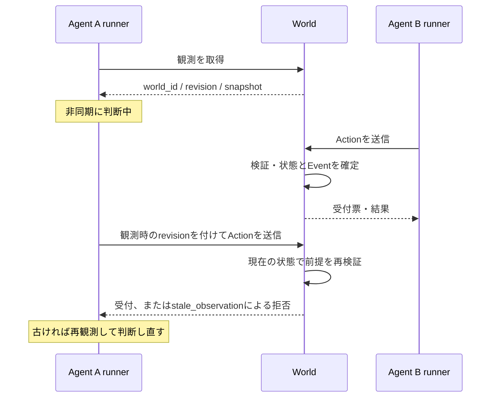

# 0002. Agentの判断・Worldの実行・結果の配送を非同期として設計する

- Status: Proposed（設計を記録。以下の契約は段階的に実装する）
- Date: 2026-09-05
- Related: [0001. World Simulatorを状態変更の唯一の責任者にする](0001-authoritative-world.md)

## 背景と現在の実装

Agentが観測してから判断を返す間にも、別のAgentやWorld内の作業は進みうる。通信にも遅延・切断・応答順序の逆転がある。「観測 → 判断 → 実行 → 結果表示」が世界全体で同期することを前提にしない。

現在のWorldSimulatorはロック内で移動とEventを確定している。これは同時更新の消失を防ぐが、古い観測に基づく判断や、同じActionの再送による二重移動を防ぐ契約にはなっていない。

現在のActor.proposeは同期関数で、SandboxSessionはGETとPOSTを直列化し、POST中のpollingを止めている。単一タブの即時moveを確認する実装として扱い、LLMや時間のかかる行動を接続する前に以下へ移行する。このADRの受付票・照会API・tick・キャンセルは、まだ実装済みの機能ではない。

## 設計方針

**判断と作業は独立して進め、Worldの確定更新だけを順序づける。** 全Agentの判断完了を待つ処理を通常の実行経路に入れない。Agentが停止・遅延しても、他のAgentとWorldは進められる。

処理を四つに分ける。

| 担当           | 責任                                          | 待たせないもの                   |
| -------------- | --------------------------------------------- | -------------------------------- |
| Agent runner   | immutableな観測を渡し、判断を非同期に取得する | Worldの更新・他のAgentの判断     |
| Action受付     | 行動IDの重複判定、受付票の保存、容量の確認    | 判断処理・長時間作業の完了       |
| World実行処理  | 前提条件の再検証、予約、状態遷移とEventの確定 | ロック内でのLLM・HTTP・長時間I/O |
| 観測・結果配送 | snapshotと行動の進捗・結果を返す              | 実行中Actionの完了               |



## 判断・実行・配送の時間を分ける

- 実時間: LLM待ち、通信、バックオフの期限。プロセス内の待ち時間には単調増加時計を使う。
- Worldのtick: 移動や採集などに所要時間を導入するときの論理時間。現段階の即時moveにtickループは追加しない。導入時も各tickで全Agentを待たない。
- revision: WorldStateの確定変更の版。経過時間でもEventの件数でもない。
- event_seq: 同一world_id内のEventの確定順序。成功だけでなく拒否・失敗にも採番する。失敗でrevisionが変わらなくても履歴を追える。

Worldを一時停止しても通信や判断のタイムアウトは進む。所要時間のあるWorld内作業はtickに従って停止する。描画フレーム数やLLMの応答時間を作業の所要時間に使わない。

## Agent runnerの契約

将来のActorは次の形に統一する。random actorもasync関数で同じ契約を実装できる。

```ts
interface Actor {
  propose(
    observation: Observation,
    context: { decisionId: string; signal: AbortSignal },
  ): Promise<ActionProposal | null>;
}
```

ActionProposalは移動方向などの意図だけを持つ。runnerが観測時のworld_id・revisionと行動IDを付けて送信する。LLMに行動IDや整合性確認用の版を自由に作らせない。

同一runner・同一Agentの判断は最大1件、未確定の行動も最大1件にする。別Agentの判断は並行に進める。全体の判断同時数・待ち行列数にも設定可能な上限を設け、キュー満杯は明示的に返す。tickごとに無制限の判断要求を積まず、判断中に届く通常の再観測要求は最新の1件にまとめる。

停止、手動操作への切り替え、world_idの変更などでは判断世代を更新し、AbortSignalを送る。SDKが中断に応じなくても、古い世代の戻り値をrunnerが捨てる。単なるrevisionの更新ごとに判断を中断すると判断が永遠に終わらなくなるため、完了後にWorldの検証を受ける。

判断期限切れは行動未送信として扱える。送信開始後の中断は送信済みかもしれないため、行動の照会へ進む。判断世代の更新だけで、Worldが受け付けた行動を取り消したことにはしない。

## Actionと受付票

Actionの識別と観測の前提を明示する。

| 項目              | 用途                                                             |
| ----------------- | ---------------------------------------------------------------- |
| world_id          | 観測したWorldの実行単位。再起動後の別Worldへ遅延要求を適用しない |
| action_id         | 一つの行動の安定したID。通信の再送でも変えない                   |
| actor_id          | 行動主体                                                         |
| decision_id       | 観測から判断・行動・Eventを追う相関ID                            |
| expected_revision | 判断の根拠にしたsnapshotのrevision。最初は必須の厳密一致         |
| type / 行動引数   | moveならdx・dy。既存のWorldルールで検証する                      |

受付票はworld_id、action_id、状態、状態の更新番号、関連Event、拒否・失敗理由を持つ。受付・開始・完了を区別し、状態の更新番号で照会応答の逆転による進捗の巻き戻りを防ぐ。

```text
                    ┌→ rejected
送信 → Worldの受付 ─┤
                    └→ accepted → running → succeeded
                           │          ├────→ failed
                           │          └────→ cancelled
                           ├───────────────→ cancelled
                           └───────────────→ rejected（開始前の再検証）
```

rejectedは実行前の前提違反・競合など。failedは開始後の作業失敗。即時moveは同じ確定処理で開始・完了まで進められる。acceptedは処理する責任を引き受けた状態であり、移動成功の意味ではない。

タイムアウトによるunknownはクライアントの認識であり、Worldの行動状態に混ぜない。HTTP送信中や結果不明をsucceeded / failedへ推測で変換しない。

### 受け付けと重複排除の順序

1. JSONの型を検証する。壊れた入力は422で返す。
2. world_idを照合する。別Worldの要求は明示的に拒否する。
3. 短い排他区間で、world_idとaction_idをキーに保存済み要求を探す。同じ内容なら既存の受付票・結果を返す。同じIDで違う内容なら409で返し、元の受付票を変更しない。
4. 新規要求だけ容量・実行前提を確認し、受付票と待ち行列への登録、または拒否Eventを同時に確定する。容量超過は未受付として返す。
5. 実行開始時に現在の状態を再検証し、行動に必要な資源やAgentの実行枠を確保する。WorldState、受付票、Eventは同じ排他区間で更新する。

重複照合はrevision検証より前に行う。成功済みの要求を再送したとき、世界が進んでいても元の成功結果を取得できる。同時に同じ要求が届いても、更新は一度だけになる。拒否・失敗の結果も同じIDで固定し、判断し直した別の行動には新しいIDを使う。

最初は単一プロセスのメモリ内台帳を使い、Worldの存続中は受付票と重複排除情報を保持する。上限に達したら新規受付を止める。古いIDを無条件に削除して二重実行を許す方式は採らない。再起動でworld_idを変え、以前の要求は適用しない。再起動をまたぐ結果保証は永続化を導入するまで提供しない。

### 古い判断と競合

最初はexpected_revisionが実行時のrevisionと異なれば、stale_observationとして副作用なく拒否する。runnerは最新snapshotを取得し、バックオフして判断し直す。古い行動に最新revisionを付け直してそのまま送らない。

例えばAgent Aがrevision 10を観測して考えている間にBがWorldをrevision 11へ進めた場合、Aの要求は再判断になる。同じAgentへの手動操作と自動操作が競合しても、クライアントのbusyだけに依存せずWorld側で検証する。

この方式は関係のない変更でも拒否するため、Agent数が増えると飢餓が起きうる。まず競合率・再判断回数を測り、その段階でEntityや資源ごとのversionと前提条件へ狭める。複数資源を使う行動は、必要な前提の検証と予約を一括で行う。無条件のlast-write-winsにはしない。

## Worldで時間のかかる作業を扱う

作業時間を導入する場合、Worldはrunning状態、開始tick、完了予定tick、確保した資源を保持する。tick処理は完了対象だけを確認する。作業の残り時間があるからといってWorldのロックを保持し続けない。

外部I/Oが必要な作業は、Worldが作成したjob_idとattempt_idを付けてロック外のworkerへ渡す。workerの完了通知は結果候補であり、WorldStateを直接更新する命令ではない。Worldが行動状態・実行世代・必要な前提を再検証してから反映する。

移動は現段階では即時に確定する。将来、採集などがtick 20から23まで実行中になっても、tick 21・22で他のAgentは行動できる。対象の消滅などで継続できなくなった場合は、その行動の規則に従って失敗させ、予約の解放とEventを同時に確定する。長時間作業の状態をWorldStateへ追加した場合、その遷移もrevision更新の対象になる。

キャンセルはWorldへの別の要求とする。受付中・実行中なら、キャンセル可能かをWorldが判断する。完了とキャンセルが競合したときは、Worldで先に確定した遷移を採用し、terminal状態を後から書き換えない。キャンセル後や再実行後に届いた古いworker結果は適用しない。

外部サービスですでに起きた副作用は、この仕組みだけでは巻き戻せない。将来その種の作業を追加するときは、外部側の冪等性キー・状態照会・補償処理を別途設計する。タイムアウトだけを根拠に「実行されなかった」と判断して外部処理を再実行しない。

## APIと画面の移行先

現行POSTの即時ActionResultは維持したまま曖昧に202を混ぜず、受付票への移行時にOpenAPIと呼び出し側を同時に更新する。

| API                                               | 移行後の役割                                                                     |
| ------------------------------------------------- | -------------------------------------------------------------------------------- |
| GET /api/world                                    | 現在のsnapshotと、それに対応するevent_seqの水位を一緒に取得する                  |
| POST /api/actions                                 | 受付票を返す。未完了なら202、terminal結果があれば200。同じ応答型で状態を判別する |
| GET /api/actions/{action_id}?world_id=...         | 結果不明の行動を照会する。別Worldは410、現在のWorldで未登録なら404               |
| POST /api/actions/{action_id}/cancel?world_id=... | キャンセル要求を登録し、受付票を返す。HTTP応答だけで取消完了とみなさない         |
| GET /api/events?world_id=...&after=...            | 確定順のEventを取得する。保持範囲外のcursorは410で再同期を要求する               |

POSTの200は行動成功そのものを意味しない。拒否・失敗も受付票の状態で判別する。world_id違い、ID再利用の内容不一致、容量超過などのHTTPエラーにも機械判定できるcodeと受付の有無を持たせる。

通信が切れたら、まず同じworld_id・action_idを照会する。404だけでは元のPOSTが今後届かないとは証明できないため、別IDを作らない。再送する場合は同じ要求・同じIDを使う。再起動による410は新しいWorldへ同じ行動を引き継がず、再観測から始める。

画面はWorldの観測を継続し、Agentごとの「判断中」、Actionごとの「受付済み・実行中・完了・結果不明」を分けて表示する。一つのbusyでWorld全体のpollingや他Agentを停止しない。座標は確定WorldStateから描画し、未確定の予定は別の表示として扱う。

同一Worldでは、古いrevisionのsnapshotを反映しない。Eventはevent_seq順に並べ、event_idで重複排除する。行動の結果が後から届いても、その結果に添付された古いsnapshotで画面を巻き戻さない。

world_id同士には新旧を比較する順序がないため、world_idが異なる応答を無条件に採用してはいけない。再接続処理でセッション世代を更新し、以前の世代の応答を破棄する。世代内の観測要求は1件ずつに保ち、POSTから別Worldの応答が届いた場合は観測で再同期する。旧世代の遅延応答で再起動前のWorldへ戻らないことをテストする。

Eventの欠落・保持期限切れでは、snapshotと同時取得したevent_seqから購読を再開する。未確定Actionは個別に照会する。snapshotだけで失われたEvent履歴を復元できたことにはしない。最初はHTTP pollingを使い、SSE / WebSocketは配送手段だけを差し替える。

## 順序、負荷、障害の保証範囲

- 確定順序はWorldが付ける。要求の生成時刻、ネットワーク到着順、判断の完了順が一致する保証はない。確定EventとActionを記録し、その履歴を再生する。LLMへの再問い合わせで同じ実行になるとはみなさない。
- 同一Agentのqueued / running枠はWorldでも1件に制限する。別runner・別タブからの競合も明示的に拒否する。
- 判断・受付・workerにはそれぞれ容量と期限を設ける。異常時の再試行は回数制限とバックオフを使い、他のAgentへ実行枠が回るようにする。
- 判断待ち時間、受付から開始までの時間、実行時間、stale拒否数、再送数、結果不明数、待ち行列長を分けて記録する。decision_id → action_id → event_idで一つの経緯を追えるようにする。
- 現段階は単一プロセス・単一World更新者。複数workerプロセスで共有Worldを書き換える運用はしない。永続化・水平分散時は受付台帳、状態、Eventを同じDBトランザクションで確定し、外部配送との境界にはoutboxなどが必要になる。

## 実装の順序と受け入れ条件

1. **即時moveのまま非同期の整合性を固める。** world_id / expected_revisionの検証、行動IDの重複排除と結果照会、Promiseを返すActor、判断世代・期限、観測を止めないsession、Eventの連番を導入する。PydanticからOpenAPIとTypeScript型を再生成する。
2. **所要時間のある行動を追加するときに実行管理を導入する。** 受付票のaccepted / running、上限付き待ち行列、論理tick、資源予約、キャンセル、worker完了通知の再検証を実装する。LLM接続だけを理由にWorldのmoveを長時間jobへ変える必要はない。
3. **再起動後の継続や多人数運用が必要になったら永続化する。** 台帳の保持・圧縮、イベント配信の再開、再試行と復旧を運用要件に合わせる。

以下は実装時の回帰テストの受け入れ条件であり、現在すべて通過しているという意味ではない。制御可能なPromise、偽時計、同期用barrierを使い、実LLMや長いsleepには依存させない。

| ケース                                                 | 必須の結果                                           |
| ------------------------------------------------------ | ---------------------------------------------------- |
| Aが判断待ちの間にBが行動する                           | BとWorldの観測は進み、Aの古い判断は再検証される      |
| 同一Actionを同時に複数回送る                           | 状態変更・確定Eventは一度だけで、同じ受付票を返す    |
| 成功後に別Actionでrevisionが進み、最初の要求を再送する | stale扱いせず元の結果を返し、追加移動しない          |
| 同じIDで引数を変更する                                 | 409となり、元の結果とWorldは変わらない               |
| Worldが確定した直後に応答を失う                        | 結果不明を経て照会で元の結果が分かる。二重実行しない |
| pollingとPOSTの応答が逆順に届く                        | snapshotも受付票の状態も巻き戻らない                 |
| 停止後に判断が返る／キャンセル後にworkerが完了する     | 古い世代の判断・結果を適用しない                     |
| 完了とキャンセルが競合する                             | terminal状態と資源の解放が一度だけ確定する           |
| 再起動後に旧Worldの要求・応答が届く                    | 新Worldに適用せず、画面も旧Worldへ戻らない           |
| Agentが応答しない／キューが満杯になる                  | 容量と期限で制御され、他のAgentとWorldが進める       |
| Eventに欠落がある／cursorが保持範囲外になる            | snapshotの水位から再同期し、未確定Actionを照会できる |

## トレードオフ

即時POSTだけの実装より、行動の識別・進捗・再同期の管理が増える。一方で、LLM待ちや長時間作業を後付けしても、Worldの所有権や通信失敗の意味を変更せずに済む。最初の厳密なrevision一致は保守的で、並行Agentが増えた場合の調整が必要になる。独立した実行の完了順序は自然に変わるため、再現性は確定履歴によって確保する。
