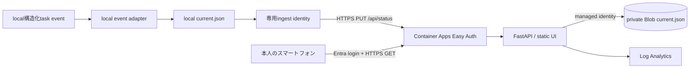

# ADR 0007: 管理statusはContainer Appsと非公開Blobへ置く

- 状態: 採用
- 日付: 2026-09-06

## 文脈

ローカル管理statusはFastAPIが同一originでUIと`GET /api/status`を配信し、local event adapterが正規化済みsnapshotを作る。スマートフォンから本人だけが読みたいが、DesktopのApp Server、session log、agent path、会話本文をInternetへ公開してはならない。Worldアプリの公開準備とはresource、認証、rollbackを分ける。

## 判断

管理専用Resource Group `rg-agent-world-mgmt-jpe`へAzure Container Apps Consumptionを1 app置く。既存FastAPIと静的UIを単一imageでそのまま動かし、0.25 vCPU / 0.5 GiB、min replica 0、max replica 1とする。最新snapshot 1件だけをStandard_LRS Storageの非公開Blobへ保存し、Container Appのuser-assigned managed identityへ対象container scopeのBlob data権限を与える。Storage shared keyとBlob匿名公開は無効にする。

Container AppsのEasy Authをsingle-tenant Entraへ接続し、`/healthz`以外を認証必須にする。許可principalは本人OIDと専用ingest service principalだけとし、backendでもGET・静的UIは本人OID、PUTはingest OIDへ分ける。Container Appsが渡すprincipal headerは外部requestから設定できないというplatform境界を使う。ingest appには`Status.Ingest` application roleだけを与え、credentialは初回承認後に発行する。

local publisherは新しい`local-event-record`だけをPUTする。送信前に観測時刻をattempt済みとしてlocal stateへ保存し、応答が不明なら停止する。同じsnapshotを次tickで再送しない。Azure SDKのBlob clientもwrite retryを0にする。公開先へ送るのはschemaで許可したlabel、role、status、timestamp、Issue / PR URL、source / received metadataだけである。

認証client secretは管理RGのKey Vaultへ置き、Container Appはmanaged identityで参照する。Log Analyticsは30日保持、日次0.023 GB cap。Budgetは月1,000円、50% actual / 80% forecast / 100% actual通知を候補とするが、請求通貨JPYと通知先を確認できるまでapplyしない。Budgetとログcapは費用のhard capではない。

local event記録とApp ServerはAzureへ公開しない。Publisherより左側は本人PC、Easy Authより右側は管理専用Resource Groupである。

## Functions候補との差

FunctionsはHTTP triggerとBlob bindingに分ければ小さく運用できるが、既存ASGI UI/APIのroute、静的配信、認証検査をFunctions向けに作り替える必要がある。Container Appsなら現在のcontainerとFastAPI contractを維持でき、World公開用RGとも分離できる。低頻度利用ではcold startを許容し、Consumptionのscale-to-zeroを使う。ただしscale-to-zero、月間free grant、常時無料を保証しない。free grantはsubscription内で共有され、Storage、Key Vault、Log Analytics、network等は別に課金され得る。

## トレードオフ

Blob containerはInternet到達可能なservice endpointを持つが、匿名・shared keyを無効にし、data planeをmanaged identityだけへ限定する。Private Endpointは固定費とDNS/VNet構成を増やすため初回には含めない。Blob Contributorは対象containerだけにscopeするがdelete権限も含むため、containerには上書き対象`current.json`以外を置かない。

min replica 0は無通信時のcomputeを抑える代わりにcold startがある。publisherのunknown停止は重複writeを防ぐ代わりに、本人がactual画面を確認して回収するまで新snapshotも送らない。local readerが止まった場合、最後の`received_at`からstaleになり、長い未完turnはunknownになる。

## 参照

- [Container Appsの課金とfree grant](https://learn.microsoft.com/azure/container-apps/billing)
- [Container Appsのscale](https://learn.microsoft.com/azure/container-apps/scale-app)
- [Container Appsの認証とprincipal header](https://learn.microsoft.com/azure/container-apps/authentication)
- [Entra application roleによるclient認可](https://learn.microsoft.com/azure/container-apps/authentication-entra)
- [Container Apps managed identity](https://learn.microsoft.com/azure/container-apps/managed-identity)
- [Storage Blob built-in roles](https://learn.microsoft.com/azure/role-based-access-control/built-in-roles/storage)
