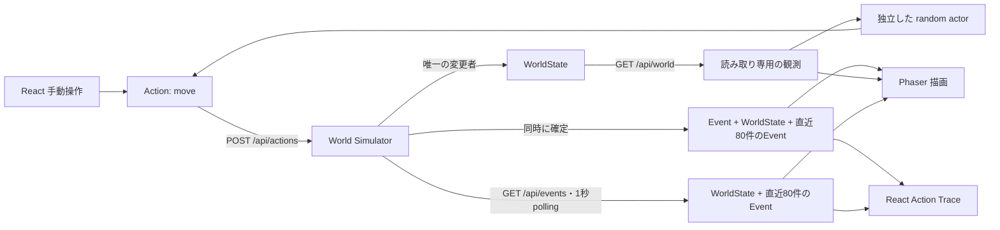

# 最小Vertical Sliceの設計

概念の責務、論理データ関係、成功・failure・通信失敗のシーケンス、テスト責務は[現行ドメインモデルと設計図](domain-model.md)にまとめる。この文書は最小Vertical Sliceの契約とルールを正本として扱う。



## モデル

| モデル     | 最小フィールド                                                            | 意味                                                      |
| ---------- | ------------------------------------------------------------------------- | --------------------------------------------------------- |
| WorldState | world_id, revision, width, height, entities                               | 確定した世界。起動ごとにworld_idが変わる                  |
| Entity     | id, position(x, y)                                                        | 初期状態はAのみ                                           |
| Action     | action_id, actor_id, type, dx, dy                                         | Actorの提案。typeはmoveのみ                               |
| Event      | event_id, action, status, reason, before, after, world_id, world_revision | Simulatorが判定した結果。入力Actionを含むため因果を追える |

Pythonの正典は `apps/world/models.py`。OpenAPI JSONとTypeScript定義はそこから生成し、CIで差分を確認する。

## moveのルール

- 原点は左上。xは右向き、yは下向き。初期サイズ8×6、初期位置A=(3,2)。
- 整数のdx/dyで `abs(dx) + abs(dy) == 1`。静止、斜め、2マス以上は `invalid_move`。
- `0 <= x < width`、`0 <= y < height`。外側は `out_of_bounds`。
- 存在しないactor_idは `unknown_actor`。
- 成功時だけ座標を更新してrevisionを1増やす。失敗時もEventを返すがStateは同一。
- World設定はSimulatorのコンストラクタ引数で変更可能。動的編集UI・APIは今回は作らない。

## HTTP契約

GET `/api/world` はキャッシュしないWorldStateの観測。GET `/api/events` は同じ時点の `{ world, events }` を `Cache-Control: no-store` で返す。eventsは確定順（古い順）の直近80件で、successとfailureを含む。POST `/api/actions` は以下のActionを受け、`{ event, world, events }` を返す。eventsの末尾はこのPOSTで確定したeventである。

```json
{
  "action_id": "d2079073-9f40-4657-a771-4ca8c02492e9",
  "actor_id": "A",
  "type": "move",
  "dx": 1,
  "dy": 0
}
```

ルール上の成功・失敗はどちらもHTTP 200でEventを返す。型違い、余分なフィールド、不正UUID、move以外のtypeはHTTP 422で状態を変更しない。通信・プロトコルエラーはUIで結果不明として記録する。

ロックは判定・State更新・上限80件のdequeへのEvent追加・Stateと履歴のスナップショット作成を一括で保護する。履歴のGETも同じロックを使い、Worldと履歴の観測時点を揃える。422の不正な入力は履歴にも追加しない。FastAPIは1プロセスで起動する。複数workerはそれぞれ別のWorldを作るため非対応。

## UIとActorの境界

`Actor.propose(readonly observation) → Action | null` は通信・描画に依存しない。random actorは境界外でも提案し、許否はSimulatorに任せる。将来のMAF等はこの提案責務を置換するか、別プロセスからHTTPで観測とActionを実行する。World側にSDKのimportやAgentのライフサイクルを追加しない。

`SandboxSession` はGET `/api/events` とPOSTを直列化し、同じworld_idの古いrevisionを採用しない。POSTが返るまで座標を更新せず、その後Phaserへ確定Stateを渡す。どちらの応答も同じWorldと履歴の組として取り込むため、別タブのActionがPOST直前に確定しても順序を保つ。通信失敗時は最後の確定Stateと履歴に未接続表示を付ける。自動再送・楽観更新・クライアントのmove判定はしない。

random実行は停止可能。停止時にすでに送信済みのActionがあれば、その結果までは反映される。Traceは共有Eventとタブ内の通信結果不明を合わせて最大80件、新しい順で表示する。1秒ごとのpollingで別タブのEventも取得し、直前の履歴snapshotのevent_id（最大80件）で重複を除く。revisionが同じfailureも取り込む。サーバーのworld_idが変わると旧Traceと既読IDをクリアし、新Worldの履歴へ切り替える。異なるworld_idのEventは取り込まない。

履歴は揮発性で、プロセス再起動で破棄する。新規タブは保持中の最大80件を取得できるが、80件を超える過去や取得間隔中に破棄されたEventは復元できない。通信結果不明が表示枠を使う場合、表示される確定Eventは80件未満となる。設計判断とトレードオフは[ADR 0008](adr/0008-shared-action-trace.md)に記録する。

## 今回の境界

Event永続化、欠落のない配信、WebSocket、Action実行の冪等性、認証、World設定の実行時変更は対象外。event_idによる表示の重複排除は、Action再実行の抑止ではない。APIに同一action_idを再送すればもう一度評価される。現在のUIは自動再送しない。複数自律Resident・一時グループ・God Agentは概念上の将来像に留める。

技術参照: [Vite](https://vite.dev/guide/)、[Phaser](https://docs.phaser.io/phaser/getting-started/installation)、[FastAPI testing](https://fastapi.tiangolo.com/tutorial/testing/)。
