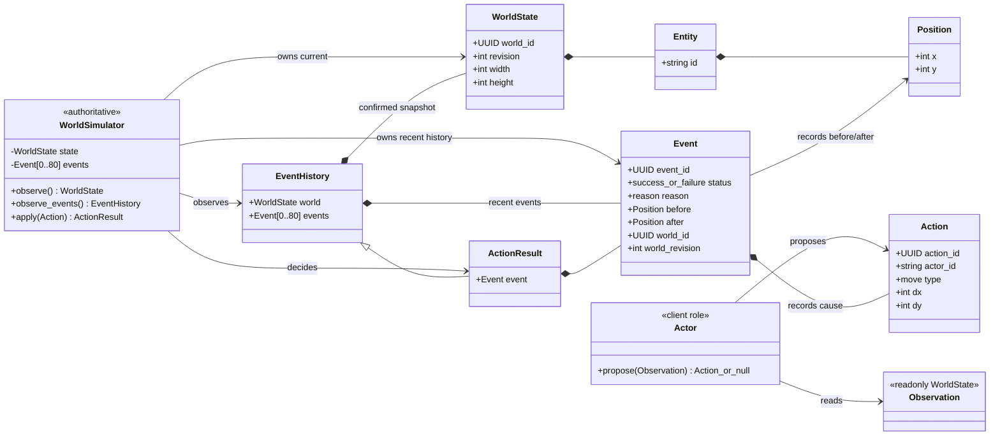
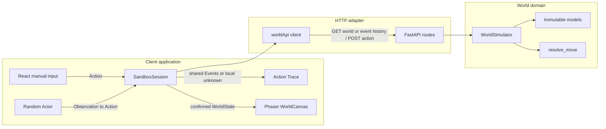
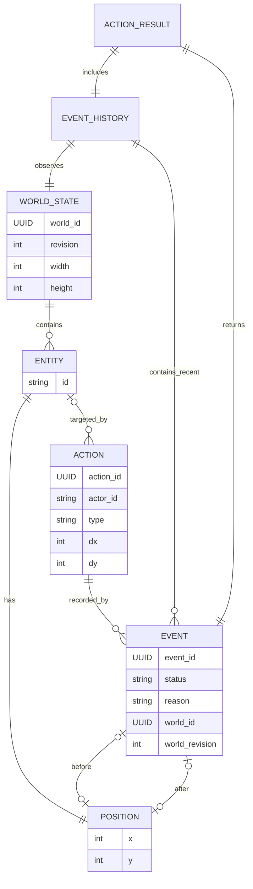
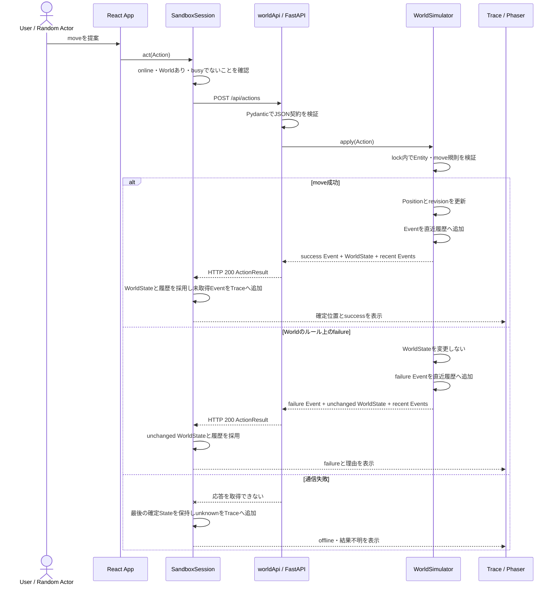
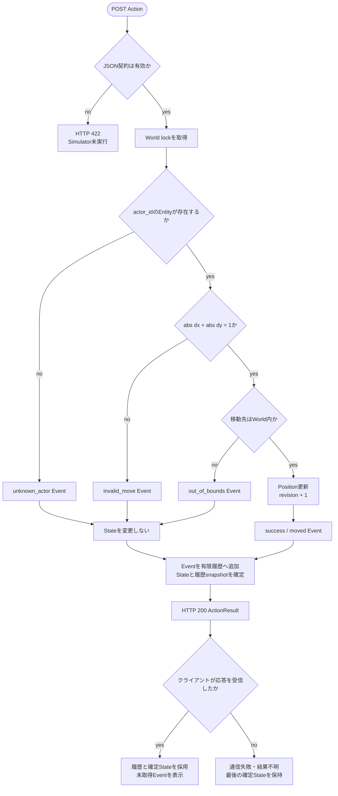

# 現行ドメインモデルと設計図

この文書は、最初のVertical Sliceで実装済みの概念と処理境界を、コードと照合して議論するための設計資料です。図は将来像を先取りせず、`A` と即時 `move` の現状を表します。

表記は次の3種類を使います。

- **実装済み**: 現在のコードとテストで確認できる事実。
- **設計意図**: Accepted ADRまたは現行architectureにある制約。
- **未決**: 要求が生じた時点で決める事項。現在の契約として扱わない。

## ドメインの目的と語彙

観察したい中心の因果は `Actor → Action → Worldの判定 → Event + WorldState` です。Actorの希望とWorldの事実を分け、成功・Worldのルール上のfailure・通信失敗による結果不明を混同しません。

| 用語           | 現在の意味                                                         | 状態     | コード上の正本                                                                |
| -------------- | ------------------------------------------------------------------ | -------- | ----------------------------------------------------------------------------- |
| `WorldState`   | ある時点で確定したWorldのsnapshot。`world_id`と`revision`を持つ    | 実装済み | [`apps/world/models.py`](../apps/world/models.py)                             |
| `Entity`       | World内に存在し、位置を持つ対象。現在は`A`だけ                     | 実装済み | [`apps/world/models.py`](../apps/world/models.py)                             |
| `Actor`        | 観測からActionを提案するクライアント側の役割。Worldを変更しない    | 実装済み | [`apps/web/src/actors/randomActor.ts`](../apps/web/src/actors/randomActor.ts) |
| `Action`       | `actor_id`で対象を指定する変更提案。現在のtypeは`move`だけ         | 実装済み | [`apps/world/models.py`](../apps/world/models.py)                             |
| `Event`        | WorldがActionを評価した確定結果。入力Actionと前後位置を含む        | 実装済み | [`apps/world/models.py`](../apps/world/models.py)                             |
| `EventHistory` | 同じ排他区間で観測したWorldStateと直近80件までの確定Event          | 実装済み | [`apps/world/models.py`](../apps/world/models.py)                             |
| `ActionResult` | 今回のEvent、WorldState、直近Eventを同じ排他区間で確定したPOST応答 | 実装済み | [`apps/world/simulator.py`](../apps/world/simulator.py)                       |
| `Observation`  | Actorへ渡す読み取り専用WorldState                                  | 実装済み | [`apps/web/src/api/types.ts`](../apps/web/src/api/types.ts)                   |
| `TraceEntry`   | Worldから取得したEvent、またはこのタブで結果不明になったAction     | 実装済み | [`apps/web/src/session.ts`](../apps/web/src/session.ts)                       |

`Entity`はWorld内の対象、`Actor`はActionを提案する役割です。現在はActorが`actor_id = "A"`を使うため同じものに見えますが、両者が常に1対1であるという契約はありません。Residentを増やす前に、認証主体・意思決定主体・World内Entityの対応を決める必要があります。

## ドメインモデル

この図の`Actor`、`Observation`、`TraceEntry`はクライアント側の概念です。Worldドメインの値はPythonのPydanticモデルが正典で、OpenAPIを介してTypeScript型を生成します。WorldがActor実装やUIをimportする依存はありません。

## 境界と主要な呼出し・データ方向

図の矢印は、主要な呼出しとデータの流れを表します。コードのimport依存は、client内ではReact・Actor・描画からsession/API型へ、World内ではHTTP routeからSimulatorとmodelへ向かいます。`apps/world`はReact、Phaser、Actor、LLM SDKを知りません。Worldの状態を更新するのは`WorldSimulator.apply`だけで、Phaserは確定した`WorldState`を描画します。根拠は[`apps/world/simulator.py`](../apps/world/simulator.py)、[`apps/world/api.py`](../apps/world/api.py)、[`apps/web/src/session.ts`](../apps/web/src/session.ts)、[`apps/web/src/world/WorldCanvas.tsx`](../apps/web/src/world/WorldCanvas.tsx)です。

## 論理データ関係

現在はDB、repository、永続event storeを持ちません。次のER図はPydantic値と応答内の論理的な関係を示すもので、物理テーブル、主外部キー、保存期間を定義するものではありません。`WorldState`と最大80件の`Event`はWorldプロセス内に保持されます。各タブの`TraceEntry`は取得した共有Eventと、そのタブだけの通信unknownを合わせて最大80件保持します。World再起動で確定Eventは失われ、タブ再読み込みで通信unknownは失われます。

`ACTION.actor_id`は文字列による論理参照です。現在のモデルには参照整合性を表す外部キーはなく、存在確認はSimulatorが実行時に行います。`EVENT.world_id`と`world_revision`もsnapshotとの因果を示す値であり、保存済みWorldStateへのDB参照ではありません。Eventは成功・failureのどちらもWorld側の有限なdequeへ確定順に追加され、POST応答と`GET /api/events`から観測できます。`ActionResult.event`は同じ応答の`events`末尾と一致します。

## Actionを確定するシーケンス

別タブで確定したEventは、`SandboxSession`が1秒ごとに`GET /api/events`を呼び、同じsnapshotのWorldStateと履歴として取り込みます。POST応答にもその時点の履歴が含まれるため、直前に別タブで確定したEventを順序どおり採用できます。`event_id`で表示の重複を除きますが、Action実行そのものの重複排除ではありません。

HTTP 422はPydanticがSimulatorへ渡す前に不正payloadを拒否するプロトコル上の失敗で、履歴にも追加しません。Worldの`failure`はHTTP 200のEventです。POSTの通信失敗ではWorldがActionを適用したか判断できないため、クライアントは`unknown`とし自動再送しません。

## 判定のアクティビティ

ロックはEntity検索、規則判定、状態更新、Eventの有限履歴への追加、Stateと履歴snapshot作成を一括で保護します。failureではrevisionを増やしませんが、確定Eventとして履歴へ追加します。同一`action_id`の重複排除は未実装なので、結果不明時に同じActionを再送してよいという保証はありません。

## 不変条件とテスト責務

| 不変条件                                           | 主な実装                                         | 回帰を防ぐ確認                                                                                           |
| -------------------------------------------------- | ------------------------------------------------ | -------------------------------------------------------------------------------------------------------- |
| Worldの内部Stateを更新するのはSimulatorだけ        | `WorldSimulator.apply`、immutable Pydantic model | [`test_observation_cannot_write_back_to_world`](../apps/world/tests/test_simulator.py)、APIのPUT 405確認 |
| 有効な隣接moveの成功時だけ位置とrevisionを更新する | `resolve_move`、`WorldSimulator.apply`           | simulatorの成功・不正move・四辺・未知Actorテスト                                                         |
| Eventと返却Stateは同じ確定結果を表す               | lock内の`ActionResult`作成                       | simulatorの成功テストとfailure時の`world_id`・`revision`一致、実FastAPI integration test                 |
| Worldと直近Event履歴は同じ観測時点を表す           | lock内のdeque更新と`EventHistory`作成            | 有限・揮発履歴、同時更新中のsnapshot、実FastAPIの別client取得テスト                                      |
| 同時Actionで更新とrevisionを失わない               | `WorldSimulator._lock`                           | `test_concurrent_actions_are_serialized`                                                                 |
| UIは応答前に移動せず、古い同一Worldを採用しない    | `SandboxSession.act`、`accept`                   | [`apps/web/src/session.test.ts`](../apps/web/src/session.test.ts)のpending・revisionテスト               |
| 別タブのsuccessとfailureを重複なく表示する         | `GET /api/events`、`observedEventIds`            | 共有Worldの有限Trace、ロールオーバー、World再起動テスト                                                  |
| World failureと通信unknownを分ける                 | Event unionとTraceEntry union                    | sessionのfailure・通信失敗テスト、APIのrule failureテスト                                                |
| Actorは観測を変更せず提案だけを返す                | `createRandomActor`                              | random actorのimmutable observationテスト                                                                |

現行範囲の重要な境界には自動テストがあります。ブラウザ上のPhaser描画、方向ボタン、random開始停止、Traceの見え方は手動の通し確認の責務であり、この資料作成時点では未検証です。API型の生成差分は`npm run api:check`、全体は`npm run check`で確認します。

## 現状評価と改善を議論する順序

### 現在すでに満たしている点

- Worldドメイン、HTTP adapter、client session、Actor、描画のモジュール境界が分かれ、依存方向もWorld側へ一方向です。
- 純粋な`resolve_move`と注入可能な`WorldApi`により、規則とクライアントの非同期順序を小さなテストで制御できます。
- immutableな契約値、単一更新者、確定応答後の描画により、UIやActorがWorldの事実を先行確定しません。
- 有限で揮発性のEvent履歴をWorldStateと同じロック内で観測し、別タブでも確定結果の因果を追えます。
- 現行モジュールは小さく、責務に対応する名前と回帰目的のコメントがあります。現在の`A + move`だけを理由にrepository、service interface、汎用rule engineを追加する根拠はありません。

このため、現時点ではコードを分割するリファクタリングを行いません。抽象層を増やしても、現在観測できる不具合、重複、変更困難、未テストの実装境界を解消しないためです。

### 今この資料で固めること

| 論点         | 判断                                                                           | 防ぐ混乱                                                  | 受入確認                                  |
| ------------ | ------------------------------------------------------------------------------ | --------------------------------------------------------- | ----------------------------------------- |
| 図の正本     | 現行全体像とドメイン関係はこの文書、設計理由はADR、API型はPydanticを正本とする | 同じ仕様を複数文書で独立更新する状態                      | 各図から実装またはADRへ辿れる             |
| failure分類  | `Event.failure`、HTTP 422、通信unknown、未検証を別の状態として書く             | 結果不明をWorld拒否や成功として扱う                       | sequence/activityと既存テストが対応する   |
| 図の更新条件 | model・境界・処理順・authority・保存方式の変更時だけ対応図を更新する           | 全PRへの形式的な図更新と、構成変更時の更新漏れ            | PRで下記対応表を確認する                  |
| 語彙         | 現在の`Actor`と`Entity`の違いを明記する                                        | 将来のResident追加時に意思決定者とWorld内対象を同一視する | 複数Resident着手前に対応関係をADRで決める |

構成変更時はPRの最新headについて、次の対応を確認します。

| 変更                                             | 確認する資料                            |
| ------------------------------------------------ | --------------------------------------- |
| `models.py`の概念・関係・API field               | ドメインモデル、論理ER、OpenAPI生成差分 |
| `simulator.py`の規則・更新・排他                 | activity、不変条件、ADR                 |
| API route、通信方式、sessionの採用順序           | 境界図、sequence、通信失敗の意味        |
| Event履歴の保持・配信・上限                      | ドメインモデル、論理ER、sequence、ADR   |
| Actorまたは描画の責務                            | 境界図、依存方向、該当テスト責務        |
| authority、永続化、複数processなど戻しにくい判断 | 新規または更新ADRとtrade-off            |

レビュー済みという状態名だけでは照合済みにしません。PRには対象head、独立review、実行した検証、未実施の確認を残し、証跡が対象headと一致することを確認します。運用の正本は[`docs/runbooks/single-task-loop.md`](runbooks/single-task-loop.md)です。

### 要求が生じたら設計する事項

| トリガー                       | 必要になる候補                            | 理由と影響                                                    | 必要な受入テスト                                     |
| ------------------------------ | ----------------------------------------- | ------------------------------------------------------------- | ---------------------------------------------------- |
| Action typeを増やす            | type別rule/handler境界                    | `WorldSimulator.apply`の分岐集中を避ける。authorityは維持する | 各ruleの成功/failureと、異なるrule間のState整合性    |
| 複数Resident・認証を入れる     | Actor、認証主体、Entityのidentity対応     | 現在の`actor_id`は単なるEntity検索キーで、権限を証明しない    | 他主体へのなりすまし拒否と、Actor停止時のWorld独立性 |
| 結果不明Actionを安全に解決する | action_id重複排除、結果照会、受付状態     | 現在は再送で二重評価されうる                                  | 応答消失後の照会、同一ID同内容/異内容、再起動境界    |
| 再起動後も状態・履歴を残す     | repository / event storeとtransaction境界 | 現在の論理ERをそのまま物理schemaとはみなせない                | State・Event・重複排除情報の原子的確定と復旧         |
| 複数World workerを使う         | 共有整合性方式と単一authorityの再定義     | 現在のthread lockはprocessをまたがない                        | 同時更新、leader切替、部分障害時の確定順序           |

これらは**未決・未実装**です。非同期Actionに関する具体的な設計候補は[`ADR 0002`](adr/0002-async-agent-world.md)にありますが、StatusはProposedであり現在の動作説明には混ぜません。

## 根拠と更新範囲

- 設計意図: [`ADR 0001`](adr/0001-authoritative-world.md)、[`ADR 0008`](adr/0008-shared-action-trace.md)、[`docs/architecture.md`](architecture.md)
- World契約・規則・HTTP: [`apps/world/models.py`](../apps/world/models.py)、[`apps/world/simulator.py`](../apps/world/simulator.py)、[`apps/world/api.py`](../apps/world/api.py)
- Clientの観測・Action・表示: [`apps/web/src/session.ts`](../apps/web/src/session.ts)、[`apps/web/src/actors/randomActor.ts`](../apps/web/src/actors/randomActor.ts)、[`apps/web/src/world/WorldCanvas.tsx`](../apps/web/src/world/WorldCanvas.tsx)
- 回帰確認: [`apps/world/tests`](../apps/world/tests)、[`apps/web/src/session.test.ts`](../apps/web/src/session.test.ts)、[`docs/testing.md`](testing.md)

この文書は現行中核の具体例です。Azureの意図図と実際に適用された構成の照合はIssue #8 / PR #14の完了後に行うため、ここでは未確認です。図の自動生成や新しいCI checkもこの変更には含めません。
