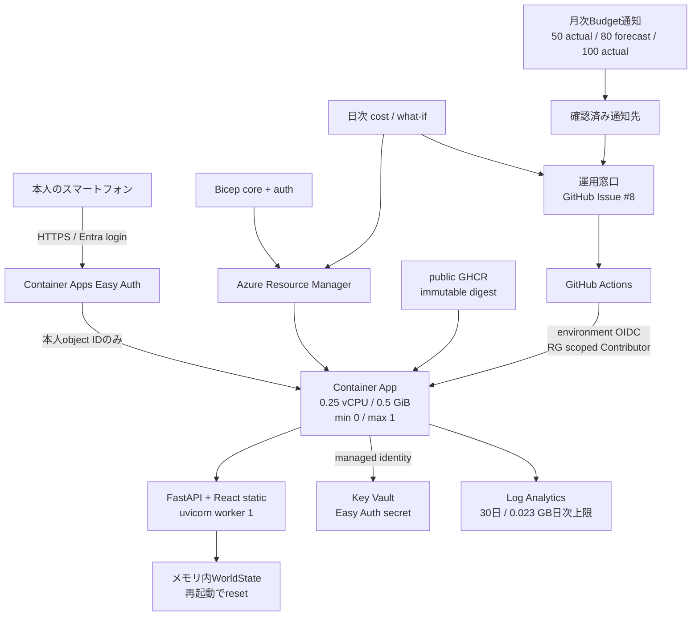

# Azure構成

## 意図した構成

Container Appsの認証sidecarは`/healthz`だけを匿名許可し、UIと`/api/*`をEntra loginへ送る。Entra側でもenterprise appへの本人assignmentを必須にし、Easy Authの`allowedPrincipals.identities`へ同じ本人object IDを指定する。

初回bootstrapではingressをinternalにしてFQDNと認証を構成する。Easy Authの本人限定actualを確認してからexternalへ切り替え、直後の認証smokeが成功した時点を初回公開とする。

ログの日次上限は急増時のsafeguardで、超過を正確に止めず、到達後は観測できなくなる。Budgetは通知であり支出を停止しない。max replica 1も同時実行数を抑えるだけで課金上限ではない。

## 適用済みactual

2026-09-06時点ではAzure resourceを作成していない。確認済みactualは次だけである。

| 項目                  | actual                                                                                              |
| --------------------- | --------------------------------------------------------------------------------------------------- |
| Azure CLI             | 2.90.0、既存user loginあり                                                                          |
| Subscription          | Enabledは`omote-dev-subscription` 1件                                                               |
| Tenant / 本人         | tenantとsigned-in user object IDを取得済み。値はGitHub environment設定時に記録する                  |
| Region                | Japan East / Japan Westが利用可能。本人利用の遅延を優先しJapan Eastを既定にする                     |
| Provider              | `Microsoft.App`、`Microsoft.OperationalInsights`、`Microsoft.Consumption`はRegistered               |
| GitHub environment    | `azure-production`はadmin bypass無効、custom policy `main` branch 1件をAPIで確認済み                |
| Cost / currency       | Cost Managementが429を返し、60秒・120秒後のread再試行上限も到達したため未確認。このtaskでは照会終了 |
| Resource / URL / auth | 未作成・未検証                                                                                      |

適用後はResource Group deploymentの出力と `scripts/azure/Test-AzureDrift.ps1` のactual検査を証跡にし、この節を事実に合わせて更新する。意図図だけを適用済み証跡にしない。
