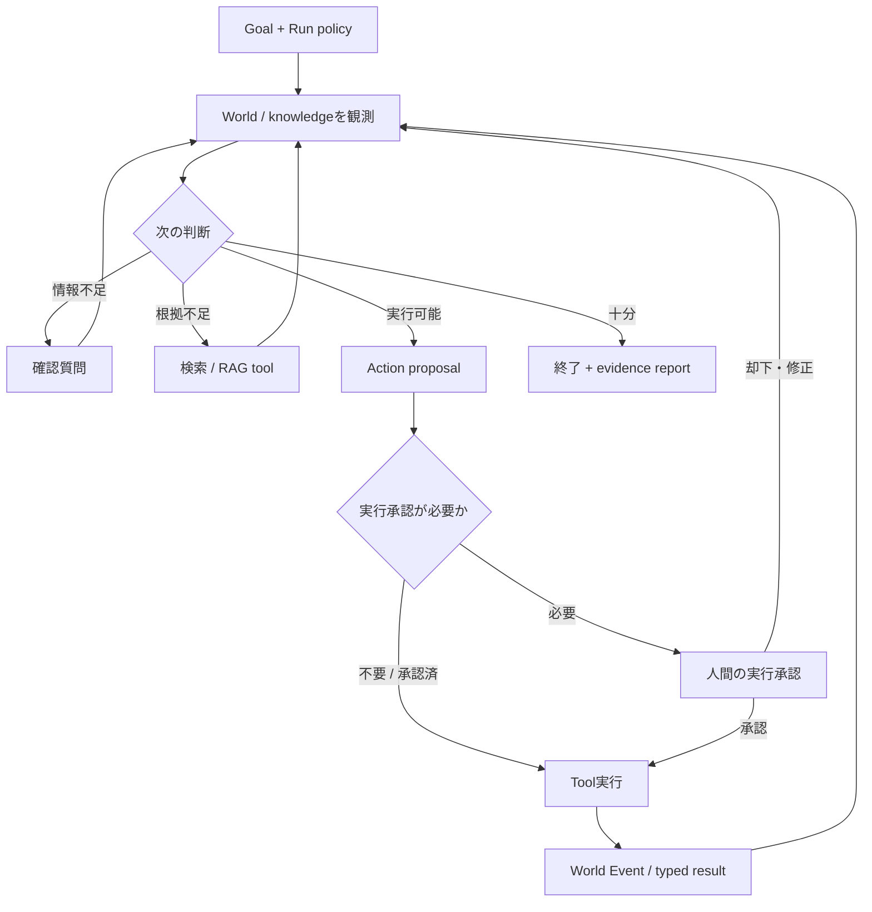

# Agent orchestration と業務World構想

- Status: Proposed
- 更新日: 2026-09-17
- 対象: 物流・小売・製造・金融・会計、および横断AI SRE

## 目的と現在地

Agent Worldを、役名を並べるデモではなく、観測、判断、tool実行、Worldの確定結果、評価を追える実験環境にする。業務ごとにstateと制約は異なるが、identity、Action、artifact、trace、evalは共有できる。

状態は次の3つを明確に分ける。

| 状態     | 内容                                                                                                                                       |
| -------- | ------------------------------------------------------------------------------------------------------------------------------------------ |
| 実装済   | 物流の固定Scenarioを、LLMなしのpure rule pipelineとWorld APIで実行するローカルデモ。詳細は[物流ルール土台](logistics-rule-foundation.md)   |
| 合意方向 | まず1つのAgentが複数toolを持ち、観測結果から次tool、追加質問、終了、承認待ちを選ぶ判断loopを作る。責任分離が必要な箇所だけmultiagent化する |
| 未決     | LLM製品、Agent framework、検索基盤、永続DB、deployment方式、各業務の外部system接続。比較evalを先に定義してから選ぶ                         |

既存Issue #79は共通Labとrun基盤、#80はLLMを使う脱出デモを扱う。本提案はそれらのownerやscopeを変更せず、業務WorldとAgent判断の評価対象を定義する。

## 用語と責任境界

| 要素            | 責任                                                  | 入出力                                                     |
| --------------- | ----------------------------------------------------- | ---------------------------------------------------------- |
| Tool            | 1つの観測または操作を、schemaと権限境界つきで実行する | typed request → result / denied / unknown                  |
| Agent           | 目標と観測から、次のtool、質問、終了、承認要求を選ぶ  | goal + observation + evidence → decision + action proposal |
| Orchestrator    | loop、予算、承認待ち、委任、相関、停止条件を管理する  | run state → 次stepまたはterminal state                     |
| World Simulator | 業務制約を検証し、共有stateを更新する唯一の主体       | Action → Event + authoritative state                       |

固定chainは、事前に列挙できる低リスク処理や再現可能なbaselineに使う。動的branchは、tool結果によって追加調査、質問、再計画、終了が変わる課題に使う。固定chainを「AI Agent」と呼ばず、動的loopも自由実行にはせず、tool schema、scope、予算、停止条件で囲う。

## 最初に作る判断loop

1 Agent版を先に作る理由は、同じ情報とtoolを与えた単独方策をbaselineにでき、役割分割そのものの効果と、より良い方策の効果を分けて測れるためである。multiagentは次の条件がある場合に限って追加する。

- 権限を同じ主体へ集約できない。
- 承認者と実行者、作成者と検証者など独立性が必要。
- contextや専門知識を分離した方が品質・費用・遅延を改善し、evalで確認できる。
- 並列調査が実際の待ち時間を短縮し、統合責任が定義できる。

役割は名称ではなく、責任、利用できる情報、許可されたoperation、受け取るartifact、返すartifact、失敗時のownerで定義する。各役をLLM processにすること自体は要件にしない。

## 確認・知識・根拠の扱い

### 3種類のHuman-in-the-loop

| 種類     | trigger                                | 人間が決めること                   | 記録                                        |
| -------- | -------------------------------------- | ---------------------------------- | ------------------------------------------- |
| 不足確認 | 必須field欠落、曖昧な指示、候補が同点  | 事実・目的・優先順位の補足         | question、answer、適用run                   |
| 実行承認 | 金額、外部送信、在庫移動、権限変更など | 提案Actionを実行するか             | proposal hash、approver、decision、期限     |
| 知識承認 | 会話からruleや例外を再利用したい       | 組織知として採用・修正・却下するか | version、reviewer、source、effective period |

現在の物流UIはScenarioボタン内でplanをauto-acceptする。これは人間承認画面ではない。

### RAGとevidence report

Agentは検索結果を即座にWorldのruleへ変換しない。取得した根拠にはsource、取得時刻、適用範囲、versionを付け、判断artifactが参照した断片を追跡する。最終報告は、結論、実行済Action、未実行proposal、主要根拠、反証・不足、Worldが確定した結果を分ける。通信結果不明を成功または失敗へ丸めない。

### 暗黙知の昇格

人間の発言から、`理由 / 適用範囲 / 例外 / 期限 / 出典`を候補artifactとして抽出する。知識承認を経て、version付きのknowledge、policy constraint、eval caseのいずれかへ反映する。一度の発言を恒久ruleへ自動昇格しない。保存するのは観測、tool call、構造化decision、引用可能な根拠、結果であり、モデルのhidden chain-of-thoughtは保存しない。

## 横断基盤

### Identity、委任、認可

- serverが解決した`principal {id, kind, roles}`を基点にし、モデルが自己申告したroleを信頼しない。
- 委任は`delegator / delegatee / allowed tools / resource scope / operation conditions / budget / expiry`を持つartifactにする。
- `authorize(principal, action, resource, conditions)`をtool実行直前に評価し、denied時はstateを変えない。
- destructiveまたは外部影響のあるoperationは、期待revision、idempotency key、承認referenceを要求する。
- ローカルsimulation selectorと本番のidentity認証を区別する。

### Traceと監査

運用traceは障害調査と性能改善のための詳細telemetryで、samplingや保持期間を調整できる。監査記録は「誰が、何を根拠に、何を提案・承認・実行し、Worldが何を確定したか」の改ざん耐性が必要な記録である。両者を同じログに混ぜない。

共通相関は`run_id / decision_id / action_id / event_id / artifact_id+version / principal_id`。statusは少なくとも`success / domain_failure / authz_denied / unknown`を区別し、unknownを無差別再送しない。再送は完全一致requestだけ同じ結果を返し、同一action_idの別payloadはconflictにする。

### Artifactとeval

- plan、evidence、approval、result、knowledgeをversion付きartifactとして保存し、creator、input world revision、source、schema versionを持たせる。
- Scenarioは初期state、利用可能tool、権限、予算、期待する安全条件を固定し、同条件baselineと比較する。
- task successだけでなく、制約違反、誤承認、不要tool call、根拠不足、費用、遅延、human escalationを測る。
- prompt、model、tool、policyの変更ごとに同じeval setを再実行し、失敗例を回帰caseへ昇格する。

## 5業務ドメインと横断AI SRE

| 構想       | authoritative state                              | 意味ある責任境界                             | 主なartifact                                                       | デモの見せ場                                                            |
| ---------- | ------------------------------------------------ | -------------------------------------------- | ------------------------------------------------------------------ | ----------------------------------------------------------------------- |
| 物流       | 在庫、倉庫能力、注文、車両、道路、期限           | 需要・在庫配分、能力計画、配車、例外承認     | shipment plan、dispatch action、delivery result                    | 人間が車両を追加した後、Agentが能力制約を観測して再配分し、actualを比較 |
| 小売       | 商品、店舗在庫、価格、販促、需要、発注           | 需要観測、補充提案、価格・販促承認、店舗実行 | demand evidence、replenishment plan、promotion proposal            | 欠品と過剰在庫のtrade-offを見てtoolを追加選択し、承認前後を比較         |
| 製造       | BOM、工程、設備能力、仕掛、品質、納期            | 生産計画、設備割当、品質判定、保全実行       | schedule、work order、quality evidence、maintenance approval       | 故障・品質異常を観測し、再計画か人間escalationを選ぶ                    |
| 金融       | 口座、position、市場data、risk limit、注文状態   | 情報取得、risk評価、取引提案、独立承認、執行 | market evidence、risk assessment、order proposal、execution result | stale dataやlimit超過で実行せず、追加取得・却下・承認待ちへ分岐         |
| 会計       | 入金、請求、送金通知、調整履歴、資料版           | 消込例外調査、候補検算、確認事項整理         | 消込準備明細、未配分一覧、営業確認票、検証report                   | 不足資料を調べ、根拠付きreview packageを作り、World残高を変えない       |
| 横断AI SRE | run、tool health、latency、cost、error、eval結果 | 検知、診断、証拠収集、確認手順の提案         | incident、RCA evidence、triage handoff、eval regression            | 失敗traceから原因候補と反証を調査し、未確認事項を運用担当へ引き継ぐ     |

金融と会計は別Worldとする。金融はposition・risk・注文執行、会計初版は入金・請求・証憑・調整履歴から作るreview packageが中心で、identityと権限の境界も異なる。
横断AI SREは6つ目の業務Worldではなく運用層である。各domain Worldを直接更新せず、domain toolと同じ認可・承認境界を通して緩和Actionを提案・実行する。

## 段階的な実装と判定

### 2026-09-18の選定

最初の業務Agentデモは、会計の[入金消込例外の調査とレビューpackage](accounting-cash-application-agent.md)とする。実務上の例外と最小評価可能性に基づく選定であり、市場性やAgent優位は未検証である。[6カテゴリのscreen](../research/domain-usecase-screen.md)に反証条件と一次資料の限界を記録する。

横断AI SREは5業務と別の運用アプリ候補として、read-onlyのインシデント証拠収集・動的トリアージに限定する。会計デモへ埋め込まず、今回の会計着工Issueのscopeにも含めない。#79の共通Lab/runtimeと#80のAI脱出デモは既存ownerの担当を維持する。

1. 物流rule版を決定論的baselineとして保持する。
2. 会計では、合成資料からreview packageを作る単一Agentと固定workflow+同じ抽出/solverを比較する。最初はWorldへeffectを出さない。
3. 未知bundleで誤配分、適切な保留、質問、根拠、修正量、費用を測り、Agentが不要という結果も採用する。
4. 会計Worldへの適用は初版の対象外とし、将来採用する場合も別scopeで判断する。
5. 価値が確認できた共通契約を#79の共通Lab/run基盤と接続する。担当境界は#79側の計画に従う。

この順序、利用するLLM、framework、永続化方式はProposedであり、製品選定は未決である。

## 参考

- 『実践AIエージェント開発』PDF物理ページ33-35（workflow、RAG、Agentの使い分け）、108-116（orchestrationとtool選択）、274-277（HITL feedbackと改善loop）。本提案は概念を参照し、実装境界と段階はこのrepository向けに定義した。
- 詳細な物流実装判断: [ADR 0012](../adr/0012-logistics-scenario-and-local-capabilities.md)
- 現在のsystem構成: [architecture](../architecture.md)
