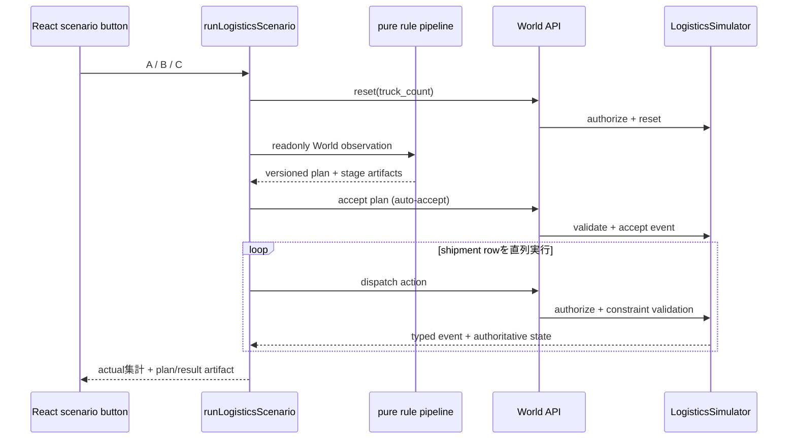

# 物流rule版の実装範囲と次段階

- Status: Implemented foundation / AI orchestration is Proposed
- 更新日: 2026-09-17

## 実装済み

2倉庫・2店舗、在庫各16、注文各8、倉庫能力W1=4/W2=12、1配送laneあたり8の固定Scenarioを実装した。World Simulatorだけが在庫、能力残、注文充足、車両利用、採用計画を更新する。

| Scenario | 条件                                  | Simulator actual                      |
| -------- | ------------------------------------- | ------------------------------------- |
| A        | 1台、近接倉庫方策                     | 4/16                                  |
| B        | 同じ初期条件で3台、近接倉庫方策を据置 | 4/16、W1の能力超過をfailureとして確定 |
| C        | 3台、capacity-aware再配分             | W1→S1=4、W2→S1=4、W2→S2=8、合計16/16  |

この比較が示すのは再配分方策の効果であり、multiagentの優位性ではない。単独のcapacity-aware方策でも同じ16/16を得られるため、将来のmultiagent評価では同じ情報と再配分能力を持つ単独Agentをbaselineにする。

## 現在の実行構成

Scenario Cのplannerは次のpure関数を順番に呼び、型付き出力を次段へ渡す。

1. `allocateInventory`: 注文と在庫から供給候補を作る。
2. `scheduleWarehouseCapacity`: 期内処理能力に収まる数量へ割り当てる。
3. `assignFleet`: lane容量と利用可能車両へ割り当てる。
4. `coordinateDueDates`: 道路時間と期限を照合し、plan rowを確定する。

handoff表示は各stageの実artifactから作る。これは独立Agentの会話や並列実行ではなく、LLMを使わない固定順のrule pipelineである。plan採用もScenario button内のauto-acceptであり、人間の承認画面ではない。

## 守っている境界

- `plan_id/version`に加え、`run_id/decision_id/row`を採用計画と照合する。
- `action_id`の完全一致再送だけ同じ結果を返す。principal、operation、payloadが異なる再利用は`action_id_conflict`でstate不変。
- authz denied、domain failure、通信結果不明を区別する。
- supported runtimeはoperator capabilityとdispatch capabilityを分離し、Actorへprincipal selectorを渡さない。
- `X-Local-Principal`はローカルsimulation selectorでありtrusted identityではない。任意HTTP callerの偽装は防がない。
- state、Event、cacheはprocess memory、結果表示はbrowser memoryにのみ保持し、永続化しない。

## 未実装

- AIが観測結果から次tool、追加質問、検索、終了を選ぶloop。
- LLM Actor、動的な再計画、並列Agent、Agent間message transport。
- 不足確認、実行承認、知識承認の画面と永続artifact。
- 本番identity認証、永続Event/artifact store、外部物流system接続。
- 認可拒否、stale revision、重複actionをUIから注入する操作。これらはAPI/Simulator testで検証する。

## 次段階の受入条件

単一Agentの最小判断loopを同じWorld APIに接続し、次を観察できること。

1. AgentがWorldを観測し、候補toolから1つを選ぶ。
2. tool結果を新しい観測として取り込み、次tool、質問、終了を再判断する。
3. ActionはproposalとしてWorld制約と認可を通り、Agentがstateを直接更新しない。
4. 各decisionが参照したevidence、tool result、終了理由を構造化artifactで追える。hidden chain-of-thoughtは保存しない。
5. rule版と同一Scenarioで、成功率、制約違反、tool回数、遅延、費用、escalationを比較できる。

全体の設計方針は[Agent orchestration と業務World構想](agent-orchestration-domain-roadmap.md)、現在のAPIとstate境界は[architecture](../architecture.md)、認可上の制約は[ADR 0012](../adr/0012-logistics-scenario-and-local-capabilities.md)を参照する。

## 検証証跡

旧base上の実装は独立reviewでblockingなしとなり、相関、冪等性conflict、state不変を再現確認した。その後、現`origin/main`へ物流専用差分を載せ替え、mainの共有Action trace、health、static配信を保持した。PRでは載せ替え後current headの`npm run check`、API/Actor/orchestrator test、実画面A/B/Cと既存moveの結果を記録する。旧headのPASSを新headのPASSとして扱わない。
