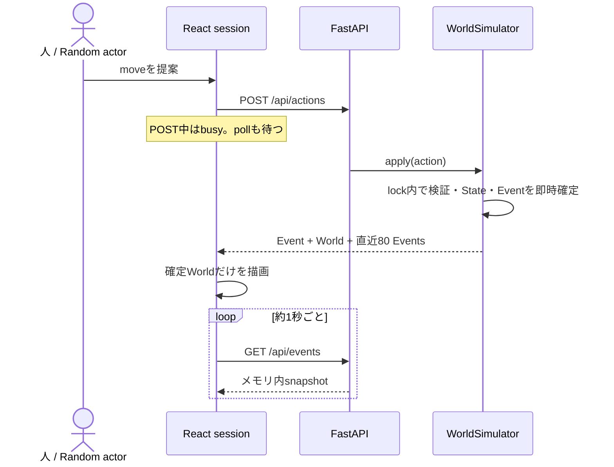
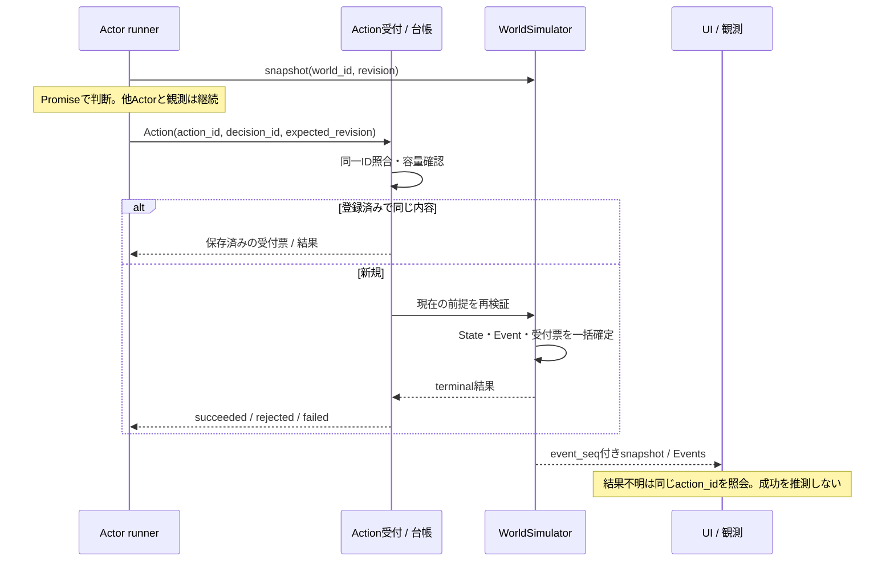
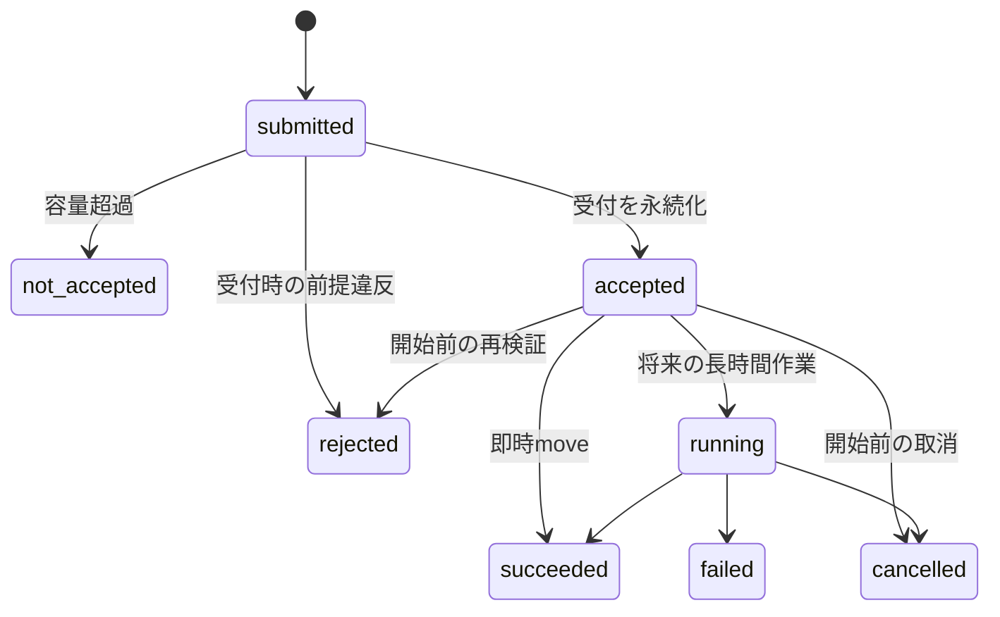
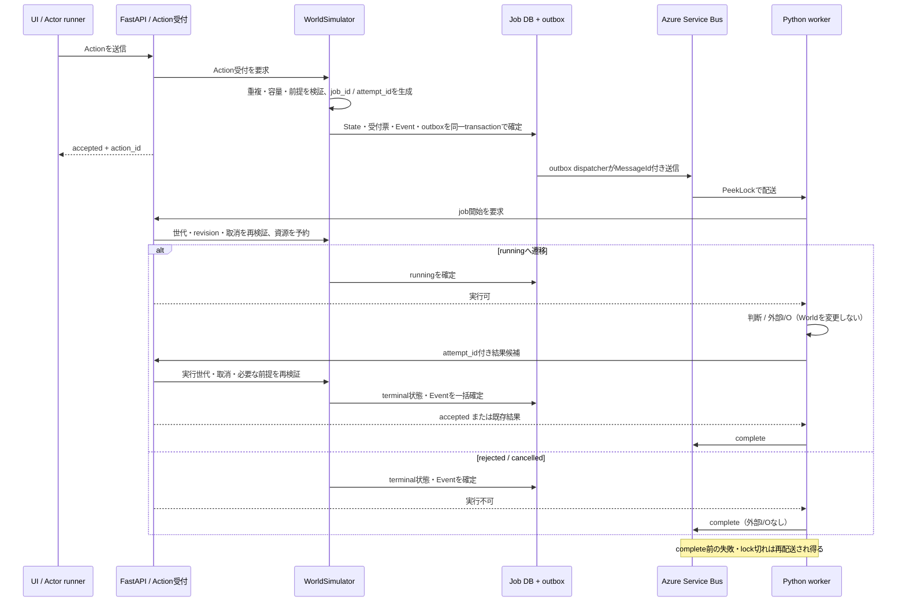

# 重要設計レビュー

技術的に重要な判断を、詳細文書を読み込む前に確認するための入口です。ここでは**製品内の非同期Action**を主題にし、開発を動かすCodex taskとは分けます。詳細な契約の正本は[ADR 0002](../adr/0002-async-agent-world.md)、現在の実装は[architecture](../architecture.md)です。

## いま動いているもの

- 実装済み: Aが`move`を発行し、`WorldSimulator.apply`だけがStateを更新する。HTTP fetchには5秒の中断期限があり、通信失敗は「結果不明」と表示して自動再送しない。
- 実装済み: Eventはメモリ内に直近80件。UIは`event_id`で表示の重複を除くが、同じ`action_id`の再実行は防がない。
- 未実装: 非同期Actor、受付票、job、queue、tick、送信後の取消、Action結果照会、Actionの冪等性、再起動をまたぐ永続化。
- 現在の制約: Actorは同期関数、同じsessionではAction中に観測も止まる。FastAPIを複数processにするとWorldがprocessごとに分かれる。

## 次に目指すsequence

まず即時moveのまま非同期の整合性を作ります。判断は並行、Worldへの確定だけを直列にします。`job`は長時間作業を追加する段階の提案であり、moveのためには導入しません。

`unknown`は通信側の認識で、Worldの状態ではありません。完了と取消が競合した場合はWorldが先に確定したterminal状態を維持します。workerが将来追加されても、その完了通知は結果候補にすぎず、`WorldSimulator`が再検証してからStateへ反映します。

## 重い処理を追加するときの具体案

第一候補は **Azure Service Bus + 公式Python SDK `azure-servicebus.aio` + 独立worker** です。APIとは別に判断・外部I/Oを動かせます。queueが配送を耐久化しても、メモリ内Worldは耐久化されません。再起動後も継続する段階では、Action受付票・outbox・worker結果候補・World/Eventを同じ永続DBへ置く設計が必要です。

配送はat-least-onceなので、`MessageId`の重複検出だけでexactly-onceとは扱いません。アプリ側でも`world_id + action_id + attempt_id`を一意にし、同じ結果候補を何度受けてもterminal状態とEventを一度だけ確定します。workerは開始許可を得るまで外部I/Oを行わず、Service Bus messageを`complete`する前に、Worldが候補を採用したか既存結果として認識したことを確認します。取消・古い世代・stale revisionなら結果候補を棄却し、WorldStateへ直接書きません。

安全性に必要な自作部分は、受付票の状態遷移、DB transaction、outbox、結果候補の冪等な取込、取消と期限、Simulatorによる最終確定です。brokerへ任せるのは配送、lock、再配送、dead-letterです。この境界はService BusでもCeleryでも消えません。最初から優先度、複雑な再試行policy、複数queue、schedule、workflow DAGは作りません。

## 道具の選び方

| 選択肢                                                    | 使い所                                       | 判断                                                                         |
| --------------------------------------------------------- | -------------------------------------------- | ---------------------------------------------------------------------------- |
| 現行FastAPIの同期処理                                     | 即時A/move                                   | 維持。moveをqueue経由へ変えない                                              |
| `asyncio.Queue` + 同一process task                        | 短命な試作、再起動時に失ってよい計算         | 安価だが非耐久。製品の長時間jobの最終形にはしない                            |
| Azure Service Bus + `azure-servicebus.aio` + 独立consumer | 長い判断、外部I/O、再配送、APIとworkerの分離 | **将来の第一候補**。managed brokerへ配送を任せる。domain job管理は自作が残る |
| Celery + Redis                                            | task lifecycleやretryのframeworkが必要な場合 | worker実装を減らせる。domain job管理は残り、Redisの耐久・可用性も運用する    |

Service BusでもCeleryでも、World更新をworkerへ分散しません。並列化するのは判断や外部I/Oで、確定順序はWorldが付けます。どちらも再配送があるため業務上の冪等性が必要です。Celeryの`acks_late`も全障害での再配送やexactly-onceを保証する機能ではありません。

外部writeの応答が不明なら自動再送せず、同じ冪等性キーで状態を照会します。外部APIの待機・再試行上限は[レート予算](api-rate-budget.md)に従います。技術前提の正本はMicrosoftの[queues / topics / subscriptions](https://learn.microsoft.com/azure/service-bus-messaging/service-bus-queues-topics-subscriptions)、[duplicate detection](https://learn.microsoft.com/azure/service-bus-messaging/duplicate-detection)、[`azure-servicebus` Python概要](https://learn.microsoft.com/python/api/overview/azure/servicebus-readme?view=azure-python)、Celeryの[Redis broker](https://docs.celeryq.dev/en/v5.6.2/getting-started/backends-and-brokers/redis.html)と[ack / 冪等性](https://docs.celeryq.dev/en/main/userguide/optimizing.html)です。

Service Bus、永続DB、独立workerは新しい費用と運用対象です。採用時はmanaged identityを優先し、queue単位の最小権限、最大同時job、期限、dead-letter回収、費用通知を実装packetに含めます。認証・権限拒否は停止して表示し、別credentialへ自動fallbackしません。具体的なSKU・DB製品・月額は未決で、この設計だけでは作成を承認しません。

## Human in the Loop

A/moveは観察対象なので、通常Actionごとの承認は置かない方針です。人の関与は次の二種類に分けます。

| 種類     | 目的                                                    | 開発を止めるか         |
| -------- | ------------------------------------------------------- | ---------------------- |
| 閲覧依頼 | sequence、trace、失敗率、選択肢を読んでもらう           | 無関係な実装は継続する |
| 判断依頼 | scope、費用、権限、外部副作用、不可逆操作を選んでもらう | 対象操作だけ停止する   |

無回答を承認とは扱いません。通知失敗時はIssueの`needs-human`と未達状態を正本に残し、同じ外部writeを再送しません。通常の設計レビューは閲覧依頼であり、判断点がなければ承認待ちにしません。

Front DeskはIssueと設計revisionを含むリンクを届けます。ユーザーの回答をIssueへ記録した時点を判断のACKとし、ADRと実装packetへ反映します。「送った」「画面に表示した」だけではACKではありません。閲覧済みの返答がなくても無関係な作業は継続します。

今回ユーザーに見てほしい判断点は二つです。

1. 次の製品実装を「即時moveの冪等性・結果照会・観測継続」に絞ってよいか。
2. 将来の長時間Action基盤を、Azure Service Bus + `azure-servicebus.aio` + 独立workerを第一候補として詳細化してよいか。

## 設計の状態と読み方

| 状態       | 意味                                       | 正本                |
| ---------- | ------------------------------------------ | ------------------- |
| 検討       | 問題と選択肢を整理中。実装済みではない     | Issue               |
| 閲覧依頼   | 推奨案を読める。返答待ちを承認gateにしない | Issue + この入口    |
| 判断待ち   | 明示した対象だけを停止。無回答は未承認     | Issue `needs-human` |
| 決定       | 理由とtradeoffを固定                       | ADR                 |
| 実装・検証 | current headの差分と証跡                   | PR                  |

重要な設計の索引:

- Worldの唯一の更新者: [ADR 0001](../adr/0001-authoritative-world.md) — 採用済み・実装済み。
- 製品内の非同期Action: [ADR 0002](../adr/0002-async-agent-world.md) — Proposed・段階実装前。
- 共有Action Trace: [ADR 0008](../adr/0008-shared-action-trace.md) — 採用済み・メモリ内80件まで実装済み。
- Azure管理status: [ADR 0007](../adr/0007-azure-management-status.md) — 製品Actionとは別系統。公開状況は[運用packet](azure-management-status.md)を参照。
- Codexのbounded local改善: [ADR 0009](../adr/0009-bounded-local-improvement.md) — 開発用の実行系で、製品のAction/jobではない。

## 開発task側の非同期性

開発ではIssueが目的・DoD・状態、PRが差分・review・検証の正本です。PMがpacketを作り、launcherがtask-primary ownerを明示的に起動または再開します。queueへのmessage保存だけではwake、受信、着工、ユーザー通知を保証しません。bounded local改善runnerにはSQLiteの状態、期限、lease、重複キーがありますが、明示起動制であり常駐schedulerではありません。現在、停止したsessionを常時wakeするserviceや、完了をユーザーへ周期配送してACKを取る仕組みは成立していません。

この不足は製品のADR 0002へ混ぜず、[PMワークフロー](pm-workflow.md)と別Issueで扱います。設計節目ではPMがreview依頼を作り、Front Deskが閲覧用リンクと判断点を届けます。ユーザー回答はIssueへ反映し、決定ならADR、実装結果ならPRへ記録します。現在の管理statusもagent processのリアルタイム表示や自動通知を実現したものではなく、別work itemで接続が必要です。
