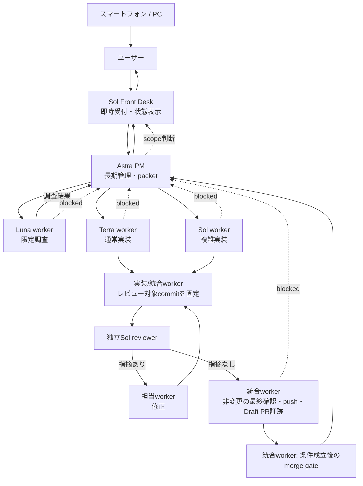

# PMワークフロー

スマートフォンとデスクトップから同じ開発を進めるとき、ユーザー窓口を単一のSol Front Deskへ集約し、長期管理をAstra PM controllerが担う運用です。プロダクト内のAgent / Worldの仕様とは独立しています。

## 状態

2026-09-06時点のFront Deskは `01a0754f-7db4-7732-bd5f-ebb0d8aabcdc`（UI名: agent-world）です。Public [yomote/agent-world](https://github.com/yomote/agent-world) を作成し、初回工場PR [#1](https://github.com/yomote/agent-world/pull/1) をmainへmerge済みです。GitHub認証は既存GCM資格情報で401となった後、`yomote` のdevice flowを完了し、`/user` で同アカウントへの認証成功を確認しました。Remoteは有効フラグ1だけを観測し、pairingとスマートフォンの実動作は未検証です。GitHub実行workerは結果をAstra PMへ報告する。文書の更新は、そのファイルを明示的に割り当てられたworkerだけが行う。

Front Deskは会話で次の短い状態をユーザーへ取り次ぐ。Issue/PRへの記録が必要な場合は、対象を割り当てられたworkerが記録する。

Front Deskはユーザーへ受付と既知の現在地を先に返し、単純な状態質問と既決事項へ即答する。新規依頼、scopeやpriority変更、複数Issueの依存、blocked、owner conflict、受入れ・release判断はAstra PMへ渡す。Astra PMが具体的なpacketをworkerへ分配し、routine修正・再reviewは既存packetのownerが継続する。Front Deskはworker完了を待つpoll loopを会話で回さない。応答後もworkerが常駐・自動再開する保証は前提にしない。

### GitHubでの進捗表示

Issueを目的、DoD、状態の正本とし、PRを差分と証跡の正本とする。進行中の工場整備は[`Factory rollout` milestone](https://github.com/yomote/agent-world/issues?q=is%3Aissue+milestone%3A%22Factory+rollout%22)で一覧できる。スマートフォンではこの検索を開き、`status: in-progress`、`status: review`、`status: blocked`、`status: ready`で状態を絞る。`owner: pm`、`owner: factory`、`owner: azure`は現在の担当laneを示す。

`status:*` labelを状態の唯一の正本とし、open Issueには同時に1つだけ付ける。Issue本文には状態を重ねて書かず、現在のowner、具体的な次手順、関連PRだけを更新する。担当workerは着工、review依頼、停止、納品可能の各遷移でlabelと本文を一度更新し、完了時にIssueをcloseする。workflow、comment、定期pollからlabelを自動更新しない。GitHub Projectsは導入時のtokenに`read:project`権限がなく実適用を検証できなかったため、このmilestoneとlabelを利用する。

```text
Front Desk: <窓口ID>
Astra PM: <管理中 / 判断確認中 / 不要>
担当: <ownerと対象>
いま: <実行中の作業>
完了: <受入済みの成果>
次: <次の判断または作業>
ユーザー入力: <必要な具体的判断。なければ「なし」>
```

## 作業の流れ



1. ユーザーはFront Deskだけへ目的と優先順位を伝える。Front Deskが管理節目をAstra PMへ渡す。workerやreviewerをユーザーが個別に巡回して管理しない。
2. Astra PMは独立した変更だけをworkerへ分配する。workerは担当ファイルと責務を完了まで所有し、既に稼働中の工場担当などは自分の修正を完了するまで所有権を維持する。初回の未コミット成果を含む統合作業も、専任workerへ委任する。
3. 分配packetには、目的、完了条件、担当ファイル、禁止範囲、依存関係、検証、報告形式、許可済み外部操作を一括で書く。workerは成果、根拠または対象ファイル、検証、未完了を短く返す。
4. 読み取り専用の調査結果はAstra PMへ返し、次の指示と担当判断に使う。コードや文書を変更した成果は、実装workerまたは統合workerがレビュー対象commitを固定してから、実装会話を継承しない独立Sol reviewerを依頼する。reviewerが完了条件、検証、未検証を照合し、指摘は担当workerが修正して新しいcommitと必要な再検証・再reviewを行う。指摘のないcurrent headだけを、統合workerが内容を変えない最終確認、Git操作、Draft PRの証跡記録へ進める。Front Deskは結果をユーザーへ取り次ぐ。Front DeskとAstra PMは調査、編集、検証、レビュー、統合、commit、push、PR作成を行わない。

Lunaは限定した読み取り調査、Terraは通常実装、Solは複雑実装と独立reviewを担う。読み取り調査だけを一律に独立reviewへ回さず、変更物をreview対象とする。子へ渡す文脈は必要最小限にし、独立した作業だけを並列にする。調査や全体検証を重複させず、最終チェックは統合workerへ一元化する。難航したworkerは無限に反復せず、Astra PMへ状況を返して担当の引き上げ判断を受ける。金額と高速化率は未測定のため主張しない。

Mind Inboxの単一窓口、Issue/PRでの状態管理、分配packet、短命branch/worktreeの考え方を踏襲します。Front DeskとAstra PMの実務はすべてworkerへ委任する。review-gateはcurrent headとGitHub保護を再検査する単発dispatchへ縮小して採用する。Claude固有のRoutine、常駐sweep、自動承認は持ち込まない。参照: [team.md](https://github.com/yomote/mind-inbox/blob/main/docs/team.md)、[child-sessions.md](https://github.com/yomote/mind-inbox/blob/main/docs/runbooks/child-sessions.md)、[branch-naming-and-cleanup.md](https://github.com/yomote/mind-inbox/blob/main/docs/runbooks/branch-naming-and-cleanup.md)。

## GitとDraft PR

初回だけは、共有ディレクトリにある未コミット成果を各担当と合意してから、専任の統合workerがまとめます。その後は独立worktreeで作業し、担当者が自分の変更をcommitします。担当packetで許可された場合に限り、担当者がpushし、Draft PRを作成または更新します。

実装workerまたは統合workerがレビュー前に対象commitを固定する。reviewerの指摘で内容が変わった場合は新しいheadとして、必要な再検証と独立reviewを行う。指摘のないheadに対する非変更の最終確認は可能だが、review待ちはPASSや完了とは扱わない。

- ブランチは `codex/<issue>-<slug>` を使う。小さな文書などIssueが不要な変更は `codex/<slug>` を使う。
- Issueには目的、owner、作業状態、次手順とPRへのリンクを記録する。Draft PRには差分と、current head SHAに対応するreview・検証・未検証の証跡を記録する。詳細は[単一課題の完遂ループ](single-task-loop.md)を参照する。
- DraftでCI jobがskipされたことはPASSではない。Ready for review後の該当runを確認できない場合は、未完了・未検証として扱う。
- CIは1 job・最大10分の予算を守る。照会は対象runを60秒以上空けて最大10回までとする。独立review証跡とcurrent-head CI、rulesetが揃ったPRは、統合workerが[信頼済みmerge gate](../adr/0005-trusted-merge-gate.md)を起動してsquash mergeまで進める。常駐監視は追加しない。詳細は [CIと外部アクセスの運用](ci.md) を参照する。

GitHub設定のapply、公開範囲の変更、mergeは、具体的な内容について既存の許可を確認する。足りない許可だけをまとめてユーザーへ尋ねる。結果不明の書き込みや拒否された操作を成功扱いせず、自動再送もしない。

## スマートフォンからの継続

スマートフォンではChatGPT Remoteから、デスクトップで動いている同じFront Deskタスクを続けます。2026-09-06に確認した[公式Remote connections](https://learn.chatgpt.com/docs/remote-connections)の手順は次のとおりです。

1. ホストPCのChatGPT desktopで **Settings > Connections > Control this PC** を開き、**Set up** または **Add** を選ぶ。
2. 表示されたQRコードをスマートフォンで読み取る。
3. 同じChatGPT accountとworkspaceを確認し、必要な認証を終える。

PCはonlineかつawakeで、ChatGPT desktop appが起動している必要があります。接続先ホストのプロジェクト、会話、ファイル、資格情報、権限、plugins、ローカルツールを使うため、接続後も既存のsandboxと承認は有効です。画面の名称と機能提供はアプリの版およびrolloutによって異なるため、上記の接続は実機で未検証として扱います。

## 承認の境界

このタスクの通常境界は `workspace-write` と `auto_review` です。担当workerは通常の編集、ローカル検証、依頼scope内のcommit / push / Draft PRを、すでにある許可の範囲で進め、同じ承認を繰り返し求めません。

端末が求める権限レビュー、ログイン、初回Remote pairingは別の境界です。PMは `full access` や `approval never` を勝手に設定しません。拒否、通信失敗、または結果不明は成功として報告せず、必要な次の判断をFront Deskでまとめます。
