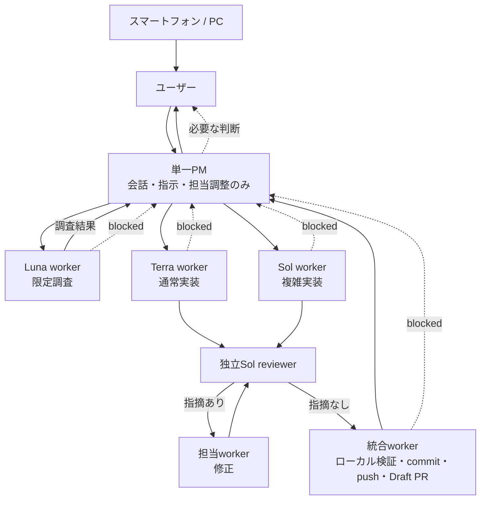

# PMワークフロー

スマートフォンとデスクトップから同じ開発を進めるとき、ユーザーの窓口を単一のPMに集約する運用です。プロダクト内のAgent / Worldの仕様や、自動化された承認・mergeを追加するものではありません。

## 状態

2026-09-06時点のPM窓口は `01a0754f-7db4-7732-bd5f-ebb0d8aabcdc`（UI名: agent-world）です。リポジトリは未作成です。GitHub認証では既存GCMによる `/user` が401となったため再試行を停止し、ブラウザーは未ログインです。公開作業は未実施です。Remoteは有効フラグ1だけを観測し、pairingとスマートフォンの実動作は未検証です。GitHub実行workerは結果をPMへ報告する。文書の更新は、そのファイルを明示的に割り当てられたworkerだけが行う。

PMは会話で次の短い状態をユーザーへ取り次ぐ。Issue/PRへの記録が必要な場合は、対象を割り当てられたworkerが記録する。

```text
PM: <窓口ID>
担当: <ownerと対象>
いま: <実行中の作業>
完了: <受入済みの成果>
次: <次の判断または作業>
ユーザー入力: <必要な具体的判断。なければ「なし」>
```

## 作業の流れ



1. ユーザーはPMだけへ目的と優先順位を伝え、PMは指示と担当調整を行う。workerやreviewerをユーザーが個別に巡回して管理しない。
2. PMは独立した変更だけをworkerへ分配する。workerは担当ファイルと責務を完了まで所有し、既に稼働中の工場担当などは自分の修正を完了するまで所有権を維持する。初回の未コミット成果を含む統合作業も、専任workerへ委任する。
3. 分配packetには、目的、完了条件、担当ファイル、禁止範囲、依存関係、検証、報告形式、許可済み外部操作を一括で書く。workerは成果、根拠または対象ファイル、検証、未完了を短く返す。
4. 読み取り専用の調査結果はPMへ返し、次の指示と担当判断に使う。コードや文書を変更した成果には、実装会話を継承しない独立Sol reviewerを依頼する。reviewerが完了条件、検証、未検証を照合し、指摘は担当workerが修正する。reviewerの確認後、統合workerが全体検証とGit操作を行い、PMは結果をユーザーへ取り次ぐ。PMは調査、編集、検証、レビュー、統合、commit、push、PR作成を行わない。

Lunaは限定した読み取り調査、Terraは通常実装、Solは複雑実装と独立reviewを担う。読み取り調査だけを一律に独立reviewへ回さず、変更物をreview対象とする。子へ渡す文脈は必要最小限にし、独立した作業だけを並列にする。調査や全体検証を重複させず、最終チェックは統合workerへ一元化する。難航したworkerは無限に反復せず、PMへ状況を返して担当の引き上げ判断を受ける。金額と高速化率は未測定のため主張しない。

Mind Inboxの単一窓口、Issue/PRでの状態管理、分配packet、短命branch/worktreeの考え方を踏襲します。PMの実務はすべてworkerへ委任する。このリポジトリへ持ち込まないのは、Claude固有のRoutineやreview-gate、全自動の承認・mergeです。参照: [team.md](https://github.com/yomote/mind-inbox/blob/main/docs/team.md)、[child-sessions.md](https://github.com/yomote/mind-inbox/blob/main/docs/runbooks/child-sessions.md)、[branch-naming-and-cleanup.md](https://github.com/yomote/mind-inbox/blob/main/docs/runbooks/branch-naming-and-cleanup.md)。

## GitとDraft PR

初回だけは、共有ディレクトリにある未コミット成果を各担当と合意してから、専任の統合workerがまとめます。その後は独立worktreeで作業し、担当者が自分の変更をcommitします。担当packetで許可された場合に限り、担当者がpushし、Draft PRを作成または更新します。

統合workerは、PMが起動した独立reviewerの報告を待ってからcommitを確定する。レビュー待ちをPASSや完了とは扱わない。

- ブランチは `codex/<issue>-<slug>` を使う。小さな文書などIssueが不要な変更は `codex/<slug>` を使う。
- IssueまたはDraft PRには、owner、作業状態、head SHA、ローカル検証、review、未検証を記録する。
- DraftでCI jobがskipされたことはPASSではない。Ready for review後の該当runを確認できない場合は、未完了・未検証として扱う。
- CIは1 job・最大10分の予算を守る。照会は対象runを60秒以上空けて最大10回までとし、常駐の定期監視とauto-mergeは追加しない。詳細は [CIと外部アクセスの運用](ci.md) を参照する。

GitHub設定のapply、公開範囲の変更、mergeは、具体的な内容について既存の許可を確認する。足りない許可だけをまとめてユーザーへ尋ねる。結果不明の書き込みや拒否された操作を成功扱いせず、自動再送もしない。

## スマートフォンからの継続

スマートフォンではChatGPT Remoteから、デスクトップで動いている同じPMタスクを続けます。2026-09-06に確認した[公式Remote connections](https://learn.chatgpt.com/docs/remote-connections)の手順は次のとおりです。

1. ホストPCのChatGPT desktopで **Settings > Connections > Control this PC** を開き、**Set up** または **Add** を選ぶ。
2. 表示されたQRコードをスマートフォンで読み取る。
3. 同じChatGPT accountとworkspaceを確認し、必要な認証を終える。

PCはonlineかつawakeで、ChatGPT desktop appが起動している必要があります。接続先ホストのプロジェクト、会話、ファイル、資格情報、権限、plugins、ローカルツールを使うため、接続後も既存のsandboxと承認は有効です。画面の名称と機能提供はアプリの版およびrolloutによって異なるため、上記の接続は実機で未検証として扱います。

## 承認の境界

このタスクの通常境界は `workspace-write` と `auto_review` です。担当workerは通常の編集、ローカル検証、依頼scope内のcommit / push / Draft PRを、すでにある許可の範囲で進め、同じ承認を繰り返し求めません。

端末が求める権限レビュー、ログイン、初回Remote pairingは別の境界です。PMは `full access` や `approval never` を勝手に設定しません。拒否、通信失敗、または結果不明は成功として報告せず、必要な次の判断をPM窓口でまとめます。
