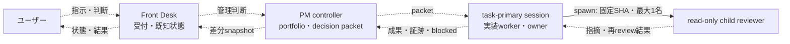

# PMワークフロー

スマートフォンとデスクトップから同じ開発を進めるとき、ユーザー窓口を単一の低遅延Front Deskへ集約し、PM controllerが長期管理、task-primary sessionのownerが1つのwork itemの完遂を担う運用です。役割は責務で定義し、モデル名に固定しません。プロダクト内のAgent / Worldの仕様とは独立しています。

## 窓口と管理の責務

Front Deskは指示受信時に、既知情報だけで短く受付、状態表示、既決事項への回答を行います。wall-clockの応答秒数は保証しません。tool待機、調査、実装、workerの完了待ち・追跡・担当調整を抱えず、新規依頼や管理判断をPM controllerへ渡します。

work itemを委任したら、Front Deskは既知状態と次に報告を受ける条件をユーザーへ返してturnを終了し、`wait_agent`、sleep、反復照会で完了を同期的に待ちません。途中更新が必要な作業でも、ownerまたはPMから届いた節目を取り次ぎ、会話への応答と同期的な実務progressを混同しません。rootの応答終了はworkerへの停止指示ではなく、明示的な停止指示またはowner/runtimeの観測がない状態で、停止やその原因を断定しません。

PM controllerはroadmap、優先順位、複数Issueの依存、owner、DoD、リスク、状態遷移、受入れ・release判断を管理します。PMOに相当する課題横断の整理とdecision packetもこの責務に含め、別のdispatcherや競合する指示窓口を設けません。worker報告に基づいて事実、制約、選択肢とtradeoff、推奨、期限、必要なユーザー判断をまとめます。技術的な根拠の調査・検証は具体的なwork itemとしてworkerへ依頼します。

新規開発、scope・priority・DoDの変更、依存やownerの衝突、blocked、受入れ・次release判断を管理の節目とします。既存packet内の修正、再検証、再reviewはownerが継続します。PMの受入れは人間の承認を代替せず、新しい承認gateにもなりません。

Front DeskとPM controllerの調査、編集、検証、レビュー、統合、commit、push、PR作成の禁止を維持します。この禁止は役割に対するもので、top-level sessionであることを理由にtask-primaryの実装workerへ適用しません。PM/launcherはpacketの受渡し、起動・再開、結果の回収を担い、work itemの実装やreview loopを引き取りません。

PM controllerは管理の節目に次の差分snapshotをFront Deskへ1メッセージで返し、Front Deskがユーザーへ取り次ぎます。これは報告の書式であり、自動通知の実装や停止後の監視継続を保証しません。Issue/PRへの記録は対象を割り当てられたworkerが行います。

製品内の非同期Action、Human in the Loop、開発taskのwakeと通知を混同せずに確認する入口は[重要設計レビュー](design-review.md)です。PMは設計の節目で閲覧依頼と判断依頼を分け、判断点がない閲覧依頼を承認待ちにしません。

```text
changed: <前回snapshotから変わった事実。なければ「なし」>
running: <ownerと実行中のwork item。なければ「なし」>
blocked: <阻害要因。なければ「なし」>
needs-human: <ユーザー判断。なければ「なし」>
next: <次の作業または判断>
```

## 指示と報告の関係

work itemは目的・担当範囲・DoDを持つ作業単位、top-level sessionは独立して起動・再開する実行単位、child agentはあるsessionがspawnした実行単位です。PMから指示を受ける関係と、PM sessionのchildであることは同じではありません。識別と実験の限界は[Codexチーム運用](codex-team.md#セッション構成の観測と限界)に記録します。



破線は指示・報告、実線はspawnによる親子関係です。図は責務の配置を示し、Front DeskやPM controllerからprimaryがspawnされたことや、全構成の同時稼働を示す実験結果ではありません。

## 分配packetと着工

PM controllerは独立して完了できるwork itemだけを分配します。委任のためだけに分割せず、稼働中ownerの担当を合意なく変更しません。ユーザーがworkerやreviewerを個別に巡回して管理する運用にはしません。

```text
work item / Issue: <作業名、IssueがあればURL>
目的 / DoD: <完了条件。Draft納品かmergeまでかも明記>
owner: <task-primaryのsession UUID、未取得ならruntime-metadata>
worktree / branch / base: <作業場所、codex/...、開始SHA>
編集境界 / 禁止範囲: <担当ファイルと触らないworktree・ファイル>
依存: <先行課題・PR・なし>
検証: <変更に適したcheck、未実行にする項目>
review: <固定commit、read-only child最大1名、fork_turns=none、再reviewは同じ担当>
既存許可 / 停止条件: <commit・push・Draft PR等、競合・拒否・結果不明等>
報告: <最終SHA、変更ファイル、check、reviewer UUIDと証跡、PR URL、未検証>
```

ownerは起動後にpacket、worktree、branch、base、既存ownerと関連PRを確認し、handoffで担当を確認します。activation待ちが指定されている場合は受付と着工を分けます。queue保存の成功だけで受信・合意・実行開始と扱わず、[セッション間の同期](codex-team.md#セッション間の同期)に従います。

Issueは目的・DoD・状態、PRは差分・証跡の正本です。長期状態を会話だけに置かず、再開時はownerがこれらとpacketから復元します。製品・インフラのarchitecture判断はADR、開発・運用の判断は専用文書またはrunbookに置きます。

## task-primary sessionの完遂ループ

1. primary owner自身が担当範囲を調査・実装し、適切なローカル検証を行います。読み取り調査だけの成果を一律にformal reviewへ回さず、変更物をreview対象とします。
2. ownerが意味のあるcommitを作り、40桁SHAを固定します。ownerが正式なread-only child reviewerを最大1名、`fork_turns = "none"` で依頼します。要件・対象範囲・固定SHA・検証結果・未検証を渡し、実装会話は継承させません。
3. reviewerは固定SHAの変更とDoDを独立に照合し、対象SHA、指摘と根拠、確認済みと未検証を返します。reviewerは編集・commit・push・外部投稿を行いません。
4. ownerが指摘を判断・修正して必要な再検証を行います。review済み内容が変わったら新しいcommitを固定し、同じreviewerへ再reviewを依頼します。旧SHAへのreviewを新しいheadの受入証跡にしません。
5. 指摘のないcurrent headでownerが最終検証と非変更の確認を行い、許可されたpushとDraft PR作成・更新、証跡記録を完了します。review結果だけをPRへ追記するための空commitや再reviewは不要です。
6. ownerが最終SHA、変更ファイル、checks、reviewer UUIDと対象SHA・結果、Draft PR URL、未検証、短い振返りをPM controllerへ返します。PM/launcherは結果を回収し、Front Deskへ差分snapshotを渡します。

task-primary ownerは対象commitとDraft PRを完了まで所有します。[単一課題の完遂ループ](single-task-loop.md)の「実装worker」「統合worker」の責務は、この単一work itemでは同じownerが担います。別work itemをまたぐ統合だけは、担当の修正完了と移管合意後に独立した統合work itemとして割り当てます。

子へ渡す文脈は必要最小限にし、独立した作業だけを並行にします。調査や全体検証を重複させず、work itemの最終検証はownerに集約します。難航時は無限に反復せず、事実と次の選択肢をPM controllerへ返します。低遅延・risk・costに応じてモデルを選びますが、金額と高速化率は未測定のため主張しません。

## 継続と受入closure

`code_done`、検証済み、review済み、merge済み、利用者へdelivery済み、Issueの目的達成、PO acceptanceは別の事実です。workerの完了報告、childのfinal、Front DeskまたはPMのturn終了、PRのmerge、中止判断を、後段の事実へ自動的に読み替えません。rootのfinal応答も停止命令ではありません。

Issueの最新目的・DoD版と成果headについて、ownerとは別のcheckerが `closure-check` 入力を作り、code、checks、review、merge、delivery、目的の6 gateを `achieved` / `unmet` / `unknown` で判定します。guardはDoD版、exact head、証跡の有無、6 gateとoverallの整合だけを検査し、業務価値を推測しません。`completed` の新規registry保存には `accept` のclosure auditが必要です。既存の署名なしJSONとStatus.Ingest認証の境界であり、checkerの人格や独立性を暗号学的に証明するものではありません。

Issueを正本とする目的、具体use case、non-goalsと最新DoD版から、checkerは必須requirement IDとcontract digestを固定します。各requirementを `generic-quality`、`domain`、`value` に分け、検証方法、必要な公開evidence、exact head、checker、`satisfied` / `unmet` / `unverified` へ対応付けます。必須IDを`not_applicable`として回避できません。guardは必須IDのcoverage、contract digest、DoD版、head、evidence URLを照合し、省略や`unverified`をacceptへ昇格しません。security、types、runtime、unknown、idempotence、tenant、observability、operations、readabilityはriskに応じた汎用品質、業務固有のuse caseはdomain、baseline比較とPO価値はvalueとして分離します。property-based testのcorrectnessはusefulnessの代替にしません。

必須IDとcontract digestの意味内容がIssue正本を完全に表すかは独立checkerの責任です。現在はtrusted local operatorが固定した入力を検査する境界であり、Issueをnetworkから自動取得して意味を証明するpolicy engineではありません。blockerは具体的なfailure、impact、evidence、requirement ID、severityの理由を記録し、好みやscope外の案はblocking findingにしません。

Issueの作成責任者は着工前にpurpose、AC ID、non-scope、期待するevidenceを定義します。この体制ではPMが責任を持ち、投稿workerは代筆します。外部Issue authorが定めた条件をPMが無断で置換しません。ACを変える場合はIssue責任者とPMが理由、履歴、影響をIssueへ記録し、対応するPRのAC mapも同期します。PR作者はAC map、変更固有のriskとinvariant、確認点、evidence、known unmetを提示します。独立reviewerは提示観点に拘束されず欠落も指摘し、PMはIssue ACと証拠で内部受入を判断します。PR作者が実装都合でACを下げることや、POの価値判断を内部受入で代替することはできません。

```powershell
python scripts/manage_status_registry.py closure-check `
  --input artifacts/status/closure-input.local.json `
  --output artifacts/status/closure-result.local.json
```

未達または不明なら、現在の責任保持者 `owner_agent`、具体的な `next_action`、再開する観測可能な `resume_trigger` を残します。次の実行担当を `next_action` に書く場合、責任保持者と同一である必要はありません。`blocked` は判断相手を含む具体的理由も残します。失敗は試行上限、replan条件、停止後のownerを次手またはblockerへ記録し、同じ操作を無限に再実行しません。新規の `blocked` / `handover-waiting` / `reconnectable` 保存とhandoff exportはこの不足を拒否しますが、導入前のsnapshot読取りは維持します。

| 受領入口    | 保存する状態                                       | 次のownerと復帰条件                                      |
| ----------- | -------------------------------------------------- | -------------------------------------------------------- |
| worker完了  | Issueがopenなら `reconnectable` または次工程の状態 | review、CI、merge、残DoDのownerと、そのreceiptまたは結果 |
| CI失敗      | `blocked`                                          | 修正owner、失敗job、修正headができた時                   |
| merge block | `blocked`                                          | gate診断owner、blocker、正規gateが利用可能になった時     |
| 判断待ち    | `blocked`                                          | PM、判断相手と内容、回答受領時                           |
| 親turn終了  | 実行中の事実を維持                                 | 報告を受けるPM、owner報告受領時                          |
| 新session   | `handover-waiting`                                 | 旧責任保持者、成功claim receipt後の明示dispatch          |

native child finalは親へ届きますが、idleな親sessionの新turn開始や利用者へのnative pushは確認できません。したがってchild finalを自動interceptするdaemonは置かず、PMが節目でcheckerを明示dispatchします。request保存とhandoff prepareのguardはルーズボールを検出しますが、PMのfinal自体を阻止するruntime hookではありません。daily棚卸しもread-onlyで、generic live loopではありません。

### PO acceptance

PO本人による最終確認が必要なrequestだけ `po_review_required=true` とします。内部closureの `accept` はPMと独立checkerによる内部受入であり、PO acceptanceではありません。保存workerは `scripts/manage_po_acceptance.py enqueue` で、Issueと価値、artifactまたはpreview URLと有効期限、期待する1〜3操作、検証済み・不明・制約、head・PR・merge、内部receipt、POへの確認点、ownerを型検証し、Front Desk向けoutboxへ保存します。同じrequest、head、artifact、DoD receipt版はdedupします。

状態は `ready_for_po_review` → `notified` → `accepted` または `changes_requested` です。ここで `accepted` はPO本人が同じthreadで明示した最終確認であり、PMの内部受入やworkerのackではありません。`notified` はFront Deskが同じthreadへ発信し、そのチャネルが受理したreceiptだけを意味し、PO本人の既読や承認ではありません。送信結果不明は `notification_unknown` に固定し、自動再送しません。`changes_requested` はowner、次手、復帰条件を必須にします。process再開時は同じstoreを読み、pending outboxを復元します。内部未達は `unmet-decision-report` として完成通知から分離します。

acceptance receiptは同じthreadのmessage参照を必須にしますが、署名付きの本人証明ではありません。保存workerはFront Deskが受け取ったPO本人の明示応答だけを記録し、推測やPMの自己申告で作成しません。現在の保証範囲はtrusted local operatorによる手動記録までで、なりすまし防止は未実装です。

PO確認が必要なrequestを `completed` として新規保存するには、内部closure auditに加えて、同じrequest、head、DoD版の `accepted` receiptが必要です。着工時に保存した必須ID、contract digest、DoD版、成果head、PO確認要否は固定し、通常の進捗更新や完了遷移で変更できません。AC改訂や成果head変更は理由と履歴をIssueへ残した新しいversioned requestとして登録します。直接completedとして初期化したり完了時に契約を縮小したりできず、保存済みcompletedのauditとPO receiptも差し替えません。既存completed snapshotの読取は維持しますが、過去の完了へ新しいreceiptを後付けしません。機械的な内部unitなど `po_review_required=false` のrequestへ一律強制しません。outbox/inboxの永続化とackは実装済みですが、PO本人へのnative自動表示、idle Front Deskの自動wake、既読確認は未実装です。Slack、email、常駐daemon、Scheduled Tasksへの連鎖は行いません。

## GitとDraft PR

独立worktreeで作業し、primary ownerが自分の変更をcommitします。担当packetで許可された場合に限り、ownerがpushし、Draft PRを作成または更新します。他worktreeの未コミット成果は、担当との移管合意なしに取り込みません。

作業・review中にmainが進んだ場合は、着手base、確認したmain、review対象headのSHAを分けて報告し、PRのbase branchはmainのまま維持します。rebase禁止のpacketでは、mainの進行だけを理由に履歴を書き換えません。最新mainとの比較ではmerge baseと変更ファイルを確認し、branch上のcheck成功を最新mainとの統合検証やCI成功に読み替えません。統合後の差分・競合・CIを確認していなければ、その範囲は未検証として残します。

review待ちはPASSや完了ではありません。dirty stateのcheck結果はその状態の結果として記録し、current headへの検証と区別します。Draft PR納品がDoDならそこで報告し、mergeやCI実行済みを意味するものとは扱いません。mergeまで許可・依頼されている場合だけ、以下の既存条件に従ってmerge gateへ進みます。

- ブランチは `codex/<issue>-<slug>` を使う。小さな文書などIssueが不要な変更は `codex/<slug>` を使う。
- Issueには目的、owner、作業状態、次手順とPRへのリンクを記録する。Draft PRには差分と、current head SHAに対応するreview・検証・未検証の証跡を記録する。詳細は[単一課題の完遂ループ](single-task-loop.md)を参照する。
- DraftでCI jobがskipされたことはPASSではない。Ready for review後の該当runを確認できない場合は、未完了・未検証として扱う。
- CIは1 job・最大10分の予算を守る。照会は対象runを60秒以上空けて最大10回までとする。独立review証跡とcurrent-head CI、rulesetが揃ったPRは、統合workerが[merge gateの運用](ci.md#merge-gateとformal-local-entryの運用)に従ってsquash mergeまで進める。常駐監視は追加しない。

GitHub設定のapply、公開範囲の変更、mergeは、具体的な内容について既存の許可を確認する。足りない許可だけをまとめてユーザーへ尋ねる。結果不明の書き込みや拒否された操作を成功扱いせず、自動再送もしない。

## スマートフォンからの継続

スマートフォンではChatGPT Remoteから、デスクトップで動いている同じ窓口の会話を続ける想定です。初回の窓口・GitHub認証・Remoteの記録は[導入記録](../codex/handoff-pm.md)にあります。Remoteは有効フラグだけを観測しており、pairingとスマートフォンの実動作は未検証です。2026-09-06に確認した[公式Remote connections](https://learn.chatgpt.com/docs/remote-connections)の手順は次のとおりです。

1. ホストPCのChatGPT desktopで **Settings > Connections > Control this PC** を開き、**Set up** または **Add** を選ぶ。
2. 表示されたQRコードをスマートフォンで読み取る。
3. 同じChatGPT accountとworkspaceを確認し、必要な認証を終える。

PCはonlineかつawakeで、ChatGPT desktop appが起動している必要があります。接続先ホストのプロジェクト、会話、ファイル、資格情報、権限、plugins、ローカルツールを使うため、接続後も既存のsandboxと承認は有効です。画面の名称と機能提供はアプリの版およびrolloutによって異なるため、上記の接続は実機で未検証として扱います。

## 承認の境界

このタスクの通常境界は `workspace-write` と `auto_review` です。担当workerは通常の編集、ローカル検証、依頼scope内のcommit / push / Draft PRを、すでにある許可の範囲で進め、同じ承認を繰り返し求めません。

端末が求める権限レビュー、ログイン、初回Remote pairingは別の境界です。`full access` や `approval never` を勝手に設定しません。拒否、通信失敗、または結果不明は成功として報告せず、必要な次の判断をPM controllerがまとめ、Front Deskを通してユーザーへ伝えます。拒否されたGitHub書き込みや結果不明の書き込みを別経路で再送しません。
