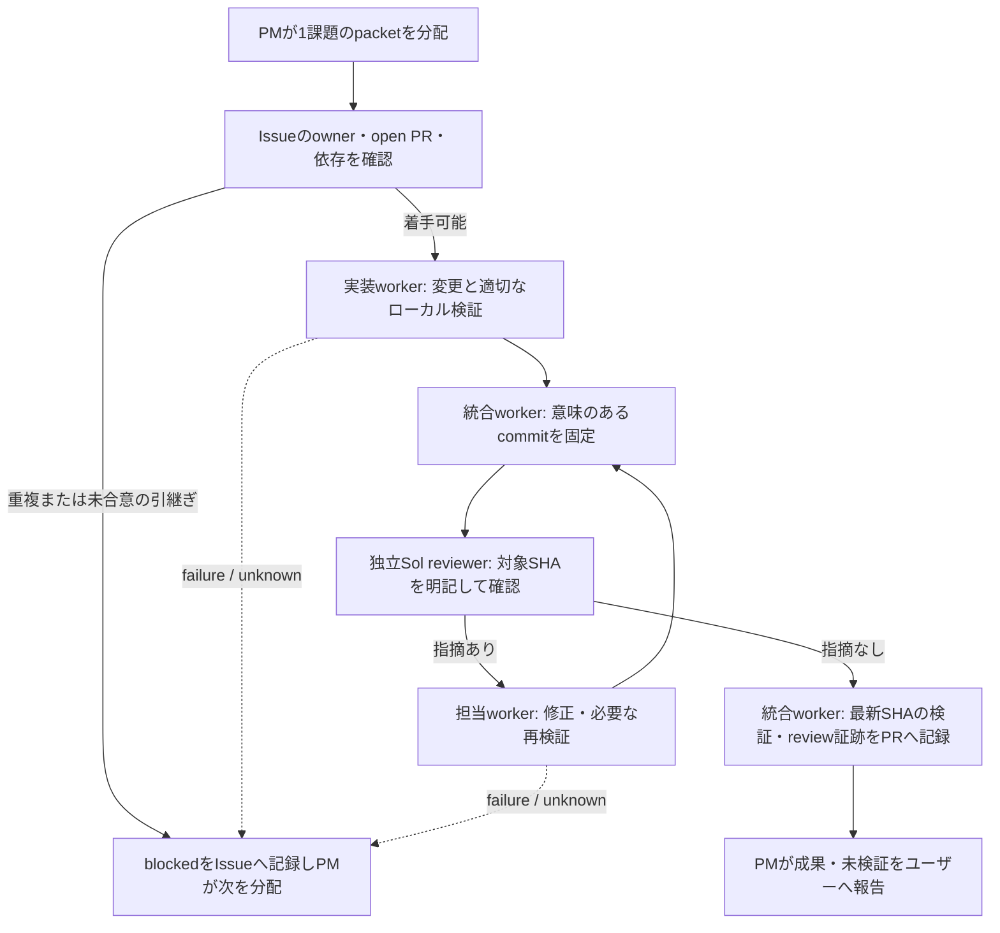

# 単一課題の完遂ループ

1回の指示で、1つの課題を実装・独立レビュー・検証・Draft PRへの納品まで進める運用です。PMの役割、モデル選択、共有ディレクトリの扱いは[PMワークフロー](pm-workflow.md)と[Codexチーム運用](codex-team.md)を正典とします。この文書は課題単位の記録と受渡しだけを定めます。自動承認、auto-merge、常駐watchdog、専用Routineは追加しません。



## 正本と着工packet

Issueは目的、DoD、状態の正本です。PRは変更差分と受入証跡の正本です。同じ情報を台帳や長いjournalへ複製しません。

PMは着工前にIssueの既存ownerとopen PRを確認する。すでに担当がいる場合は、その担当と合意した引継ぎが記録されるまで着手しない。期限や応答待ちだけを理由に所有権を奪わない。専用のclaim台帳、CAS、WIP制御は現在の対象外です。

packetには次を一括で書く。PMはpacketを渡した後、技術調査・編集・検証・レビュー・Git操作をせず、結果に基づいて次の担当を分配する。

```text
Issue: <URL または #番号>
目的 / DoD: <利用者にとって完了といえる結果>
owner: <実装worker>、統合: <worker>、review: <独立Sol reviewer>
branch / 編集境界: <branch・担当ファイル・禁止範囲>
依存: <先行課題・既存PR・なし>
検証: <変更に見合うコマンド・手動確認・未実行にする項目>
review: <独立reviewの対象commit SHAを後で記録する>
既存許可: <commit / push / Draft PR更新など>
停止条件: <競合、認証拒否、通信失敗、結果不明、外部許可不足>
```

小さな文書変更でも、Issueがある場合はこのpacketを使う。branch名は[PMワークフロー](pm-workflow.md#gitとdraft-pr)に従う。作業中の同一ファイルは、合意なしに変更しない。

## 状態と停止

Issueには状態ごとに、次の担当、具体的な次手順、既実施と未実施を短く残す。通常の状態は `in_progress`、`review_pending`、`blocked`、`failed`、`unknown` とする。納品後はDoDに応じてIssueの通常の状態へ戻す。Draft PRを出しただけでIssueをcloseしない。

| 状態             | 記録する事実                                 | PMの次の分配                                           |
| ---------------- | -------------------------------------------- | ------------------------------------------------------ |
| `in_progress`    | owner、編集境界、実施中の作業                | 実装workerの完了報告を待ち、独立した作業だけを分配する |
| `review_pending` | review対象のcommit SHA、実行済み検証、未検証 | 独立Sol reviewerへそのSHAを渡す                        |
| `blocked`        | 阻害要因、既に試したこと、必要な判断         | 必要な判断または依存の担当を分配する                   |
| `failed`         | 失敗したコマンド・操作、終了結果、再現条件   | 修正または原因調査を具体的に分配する                   |
| `unknown`        | 結果不明になった操作、確認できた範囲         | 書き込みを再送せず、事実確認または判断を分配する       |

認証・権限拒否、ツール拒否、通信失敗、外部書き込みの結果不明は、別経路で迂回しない停止条件である。同じ失敗を無限に再試行しない。CIの照会と制限応答は[CI運用](ci.md)の予算に従う。アプリが担当を自動wakeしたり、常駐で状態を監視したりする前提は置かない。

## 実装から納品まで

1. 実装workerはpacketの編集境界で変更し、検証結果を `pass`、`fail`、`not_run`、`skipped`、`unknown` の事実として区別する。dirty stateで実行したcheckは、そのdirty stateの結果であり、最新commitのPASSとは記録しない。
2. 統合workerは必要な変更と検証を含む意味のあるcommitを作り、review前の固定対象SHAをIssueに記録する。review待ちは完了やPASSではない。
3. 独立Sol reviewerは実装会話を継承せず、対象SHA、確認したDoD、検証結果と未検証、指摘の有無を返す。SHAが変わったら、その旧reviewは新しい変更の受入証跡にならない。
4. 指摘があれば担当workerが修正し、影響に応じて再検証する。統合workerは新しいcommitを作り、最新SHAに対する独立reviewを再依頼する。
5. 指摘がない最新SHAについて、統合workerはPR本文またはPRコメントに、対象SHA、review結果、検証結果、未検証を記録する。このGit外の証跡への追記だけのために新しいcommitや再reviewを連鎖させない。
6. PMは証跡に基づき、成果、検証、未検証、次のDoD上の作業をユーザーへ報告する。既存許可の範囲では、毎回形式的なユーザー承認を求めない。

「実装・レビュー・検証完了しDraft PRで納品」は、このループの完了として報告できる。一方、merge済み、GitHub Actionsの実行済み、本番確認済みは別の事実であり、未実施なら未検証として残す。

## 最終証跡の書式

PR本文またはコメントには、最後に次の短い記録を残す。PRテンプレートの欄を使えば十分で、チェックの全ログや同じ状態の転記は不要である。

```text
対象head: <40桁SHA>
独立review: <reviewer> / <指摘なし または 指摘と解消先>
検証: <command または 手動確認> — <pass / fail / not_run / skipped / unknown>
変更後の再確認: <対象headで行った確認、または not_run>
未検証: <CI、実機、merge後など>
```

DraftのCI jobが`skipped`なら、その事実を記録し、`pass`と書かない。レビューや検証が対象headより前のものなら、対象headに対して再確認するまで納品証跡に使わない。

## 受渡し時の振返り

統合workerはIssueまたはPRの受渡しに「学び: なし」または1〜2文の学びを残す。再発防止が必要な場合だけ、原因に応じて規約、回帰test、検査、または別Issueへ反映する。毎回の規約追加やtestの増殖は行わない。

この運用は手作業のreview-gateを明確化するが、新しい強制CI checker、bot、定期処理を導入しない。自動化やclaimの採用は、必要な利用枠・権限・実行痕跡・異常時の回収を設計できた別課題で判断する。
